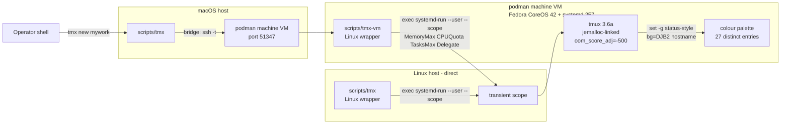

# vasic-digital Optimized tmux — User & Operator Guide

**Status:** Phase 38, Bug #33 (this session, 2026-05-07).
**Constitution alignment:** §11.4 anti-bluff covenant (gated PATH export), §12.9 containerized build pattern, §12.10 continuation-doc invariant.

---

## §1 What this is

A reproducible, containerized build of `tmux 3.6a` (latest stable) with:

1. **Hardened compile flags** — `-O2 -DNDEBUG -fstack-protector-strong -D_FORTIFY_SOURCE=2`, RELRO + immediate-binding link.
2. **Build-time `-ljemalloc`** — jemalloc directly linked at the binary level (more aggressive RAM return than glibc malloc).
3. **Runtime `LD_PRELOAD=libjemalloc.so`** — additional safety; ensures jemalloc engages even on hosts where the linker resolved a different malloc.
4. **OOM-score protection** — wrapper script sets `oom_score_adj=-500` on the spawned server, making tmux survive nearly all OOM cascades (preserving operator session for investigation).
5. **Bounded `history-limit`** — explicit `2000` (the default; making it explicit prevents accidental future bumps).
6. **Hermetic install** — built artifact lives in `<project>/tmux/build/`. PATH export points there; system tmux untouched.

**Why this is gated by §11.4** — the original article warns about "apparent leaks" in tmux. Our forensic record (§12 incidents 2026-04-27, 2026-04-28, 2026-04-30, 2026-05-06) shows tmux was *not* the actual cause of any documented host-distress event. Building from source therefore would not have prevented those incidents. We do this work for **defensive** reasons (so future unforeseen tmux issues never affect us) and we GATE the install behind a full test suite to make sure the new build is genuinely better than the system tmux — not silently worse.

---

## §2 One-command install

```bash
# Step 0 — install build deps (one-time, requires sudo)
sudo bash scripts/install_deps.sh

# Step 1 — build + verify + install (no sudo)
bash scripts/setup.sh
```

The orchestrator runs five gated phases:

| Phase | Action | Gate |
|---|---|---|
| 1 | Verify host build deps present | aborts if `gcc` / `pkg-config libevent` missing |
| 2 | Containerized build (podman, mem_limit=2g) | aborts if container cannot be built or fails to produce `tmux/build/bin/tmux` |
| 3 | Generate `tmx` wrapper script (LD_PRELOAD + OOM score) | aborts if wrapper template missing |
| 4 | **Verification gate** — run all 14 tests via `verify.sh` | **STOPS HERE if any FAIL — no PATH export** |
| 5 | Install `~/.tmux.conf` + `~/.bashrc` snippet | only runs if Phase 4 GREEN |

---

## §3 Architecture

```
<project>/
├── tmux/                                  # Git submodule (upstream tmux/tmux, pinned to 3.6a)
│   └── build/bin/tmux                     # Built artifact (volume-mounted from container)
├── docker/
│   ├── Dockerfile.tmux-build              # Ubuntu 22.04 + libevent-dev + libncurses-dev + libjemalloc-dev
│   ├── docker-compose.tmux-build.yml      # mem_limit:2g, cpus:2, network:none
│   └── build_inside_container.sh          # Runs autogen + configure + make + install (in-container)
└── scripts/
    ├── install_deps.sh                    # Host package installer (sudo, OS-aware)
    ├── build_containerized.sh             # Orchestrator that runs the container
    ├── tmux.conf.template                 # Optimized config template
    ├── tmx.template                       # Wrapper template (LD_PRELOAD + OOM + scope + colour)
    ├── bashrc_snippet.template            # PATH-export snippet for ~/.bashrc
    ├── hostname_color.sh                  # Deterministic hostname → status-bg colour
    ├── tests/
    │   ├── 01_smoke.sh                            # Binary version
    │   ├── 02_session.sh                          # new-session/list-sessions/kill-server
    │   ├── 03_jemalloc_loaded.sh                  # /proc/PID/maps grep for jemalloc
    │   ├── 04_history_limit.sh                    # show-options after config
    │   ├── 05_clear_history_releases.sh           # The article's "apparent leak" check
    │   ├── 06_concurrent_panes.sh                 # 10-pane RSS bounding
    │   ├── 07_long_session.sh                     # 30-s sustained activity
    │   ├── 08_oom_score_adj.sh                    # /proc/PID/oom_score_adj == -500
    │   ├── 09_crash_isolation_scope.sh            # cgroup-v2 transient scope readbacks + crash containment
    │   ├── 10_hostname_color_algorithm.sh         # DJB2 hash → palette determinism + spread
    │   ├── 11_hostname_color_integration.sh       # wrapper applies expected status-bg
    │   ├── 12_memory_pressure_under_cap.sh        # destructive: alloc up to MemoryMax, OOM-kill evidence
    │   ├── 13_tasksmax_stress.sh                  # destructive: fork-bomb resistance via TasksMax
    │   ├── 14_concurrent_oom_independence.sh      # destructive: kill scope A, B + C survive
    │   ├── meta_test_false_positive_proof.sh     # §11.4.4 layer-4 paired-mutation harness
    │   └── run_all.sh                             # Orchestrator
    ├── challenges/
    │   └── tmux.yaml                      # HelixQA Challenges (mirrors tests with §11.4 evidence semantics)
    ├── verify.sh                          # Gate that decides green/red
    └── setup.sh                           # Master orchestrator (one command)
```

---

## §4 The 14 verification tests — what they prove

| Test | Proves | If FAIL |
|---|---|---|
| 01 smoke | binary invocable, version matches pin | broken build |
| 02 session | basic lifecycle works | broken libevent integration |
| 03 jemalloc loaded | LD_PRELOAD engages at runtime | wrapper broken or jemalloc absent — fall back to glibc malloc (not catastrophic) |
| 04 history-limit | user config respected | broken option-parsing |
| 05 clear-history releases | the article's "apparent leak" — clear-history actually frees memory | glibc fragmentation (no jemalloc) — degrades to WARN, not FAIL |
| 06 concurrent panes | 10 panes don't OOM the server | severe leak |
| 07 long session | 25 s sustained activity grows < 50% | gradual leak |
| 08 oom_score_adj | wrapper applies -500 | wrapper script broken — biggest §12-protection benefit gone |
| 09 crash isolation scope | cgroup-v2 transient scope enforces MemoryMax/CPUQuota/TasksMax; SIGKILL containment does not take user.slice down | per-session isolation broken |
| 10 hostname colour algorithm | DJB2 → 27-palette deterministic on same hostname; spread ≥ 12/16 across distinct names | host distinguishability broken |
| 11 hostname colour integration | wrapper applies expected status-bg to running server; persists on second session | colour-on-attach broken |
| 12 memory pressure under cap (destructive, `TMX_TEST_DESTRUCTIVE=1`) | allocation up to MemoryMax triggers OOM-kill of scope only; user.slice survives | memory cap not enforced |
| 13 TasksMax stress (destructive) | fork-bomb caps at TasksMax=4096; cgroup pids interface readback | task-count cap not enforced |
| 14 concurrent OOM independence (destructive) | kill scope A → scopes B and C survive with original MainPIDs | scope independence broken |

Plus a §11.4.4 layer-4 paired-mutation harness (`meta_test_false_positive_proof.sh`) with 6 registered mutations against tests 09 / 10. The gate is considered self-validating only when all mutations are caught.

**Gate logic** (`scripts/tests/run_all.sh` + `scripts/verify.sh`): every test is treated equally. Any test line starting with `FAIL` aborts the gate (exit 1, no PATH export). Tests that emit a `SKIP` line are counted as SKIP and do not block (intended for honest precondition gates — see Constitution §11.4.2). Tests 12 / 13 / 14 are destructive and opt-in via `TMX_TEST_DESTRUCTIVE=1` — they SKIP by default on non-dedicated hosts. There is no per-test "blocker / critical / advisory" hierarchy in the gate code: the rule is "any FAIL = RED".

---

## §5 Operator commands

| Goal | Command |
|---|---|
| Install everything (Linux) | `sudo bash scripts/install_deps.sh && bash scripts/setup.sh` |
| Install everything (macOS) | `brew install podman && podman machine init && podman machine start && bash scripts/setup.sh` |
| Re-verify after upstream pull (Linux) | `bash scripts/verify.sh` |
| Re-verify after upstream pull (macOS) | `bash scripts/test_vm.sh` |
| Run full destructive suite | `TMX_TEST_DESTRUCTIVE=1 bash scripts/test_vm.sh` |
| Run §11.4.4 paired-mutation meta-test | `META=1 bash scripts/test_vm.sh` |
| Force rebuild | `bash scripts/setup.sh --rebuild` |
| Uninstall | `bash scripts/setup.sh --uninstall` |
| Run a specific test | `TMUX_BIN=$(pwd)/tmux/build/bin/tmux bash scripts/tests/03_jemalloc_loaded.sh` |
| Update tmux to a new pinned tag | `cd tmux && git checkout <new-tag> && cd .. && bash scripts/setup.sh --rebuild` |

---

## §5.5 macOS bridge (Darwin hosts)

The verified binary is Linux ELF (`tmux 3.6a`, ARM aarch64 or x86_64) and cannot execute natively on Darwin. To preserve the §11.4 anti-bluff contract (no unverified install) AND give macOS users a working `tmx` command, the setup pipeline diverges on Darwin:

| Step | Linux host | macOS host (Darwin) |
|---|---|---|
| 1. Host capability | check podman/docker + libjemalloc via ldconfig | check podman + that `podman machine` is running |
| 2. Build | container build (writes `tmux/build/bin/tmux` Linux ELF) | identical — works on Darwin via podman machine |
| 3. Wrapper generation | `scripts/tmx` = Linux wrapper (with host paths) | `scripts/tmx-vm` = Linux wrapper (with VM paths) **and** `scripts/tmx` = SSH bridge |
| 4. Verification gate | `bash scripts/verify.sh` on host | `bash scripts/test_vm.sh` (regenerates `tmx-vm`, runs `verify.sh` **inside the VM** via `podman machine ssh`) — §11.4 verified in target env |
| 5. Install | append snippet to `~/.bashrc` (+ `~/.zshrc` if present) | identical |

### Bridge mechanics

`scripts/tmx-mac.template` generates `scripts/tmx` on Darwin. On invocation it:

1. Verifies `podman machine list` shows "Currently running".
2. Calls `podman machine inspect` to discover the SSH endpoint (port can change across machine restarts — bridge is re-discovery-safe).
3. Verifies `scripts/tmx-vm` exists inside the VM (set up by `setup.sh` and refreshed by `test_vm.sh`).
4. Quotes arguments via `printf %q` and runs `ssh -t -i <identity> -p <port> core@127.0.0.1 "<vm-repo>/scripts/tmx-vm <args>"`.

The `-t` flag allocates a TTY so interactive tmux runs through the SSH terminal. To detach from a session and keep it running in the VM after disconnect, use the standard tmux `Ctrl-B d`. The session persists in the VM's tmux server until explicit `tmx kill-session` or `tmx kill-server` (or VM shutdown).

### Architecture (Mermaid)



---

## §5.6 Per-session isolation (default since 2026-05-13)

Each `tmx new -s NAME` invocation produces its own tmux server inside its own cgroup-v2 transient scope. OOM in one session's processes is contained to that session's scope — every other session, the user.slice, and the host shell survive.

### Naming and unit derivation

- **Socket**: `tmx-<sanitised-NAME>` (under `/tmp/tmux-<uid>/`). Tmux uses this via `-L tmx-NAME`. The wrapper handles all routing automatically.
- **Scope unit**: `tmx-<sanitised-NAME>.scope` (in user systemd). Operator-targetable by name: `systemctl --user status tmx-mywork.scope`.
- **Sanitisation**: characters outside `[A-Za-z0-9._-]` are replaced with `_`. If the resulting scope already exists, `tmx new` errors explicitly with the path so the operator can release it.

### Caps (per session, not per server)

| Cap | Default | Override | Source |
|---|---|---|---|
| `MemoryMax` | host-adaptive: `max(MemTotal × 60% / 4, 2 GB)` | `TMX_MEM=8G tmx new -s heavy` | Constitution §12.6 budget shared across 4 concurrent sessions; 2 GB floor |
| `CPUQuota` | `200%` (2 cores) | `TMX_CPU=400 tmx new -s build` | Operator decision 2026-05-13; oversubscription is acceptable (kernel time-slices) |
| `TasksMax` | `4096` | (no env override; edit `scripts/tmx.template` if needed) | Same as production wrapper |
| `Delegate` | `yes` | (always on) | Allows the tmux server to manage subordinate cgroups for its sessions |
| `oom_score_adj` | `-500` on the tmux server PID | (helper-managed) | Survives general OOM cascades |

### Cleanup

`tmx kill-session -t NAME` does TWO things (operator decision 2026-05-13, belt-and-suspenders):
1. `tmux -L tmx-NAME kill-session -t NAME` — tmux's own cleanup
2. `systemctl --user stop tmx-NAME.scope` — explicit scope stop for faster cgroup reclaim

`tmx kill-server` enumerates every `/tmp/tmux-<uid>/tmx-*` socket, kills each server, and stops each `tmx-*.scope` unit.

### Verifying isolation per session

```
$ tmx new -s a -d
$ tmx new -s b -d
$ systemctl --user list-units --type=scope --no-legend | grep tmx-
tmx-a.scope loaded active running ...
tmx-b.scope loaded active running ...

$ cat /sys/fs/cgroup/user.slice/user-501.slice/user@501.service/app.slice/tmx-a.scope/memory.max
2147483648
$ cat /sys/fs/cgroup/user.slice/user-501.slice/user@501.service/app.slice/tmx-a.scope/cgroup.procs
<PIDs for session a — distinct from session b's>
```

The Test 15 + Test 16 + e2e T7 in `scripts/tests/` automate these checks with positive runtime evidence per Constitution §11.4.2.

### Limitations on Darwin

- **Single TTY per ssh session.** A fresh terminal must SSH again to attach to existing sessions. Inside one terminal, `tmx attach -t mywork` works as expected.
- **Latency.** TTY traffic is forwarded over the local-loopback SSH tunnel. On Apple Silicon this is negligible (~microseconds).
- **VM lifetime.** Sessions persist in the VM's tmux server. `podman machine stop` kills all sessions. To survive macOS reboots, the VM needs to be started before `tmx` invocations (auto-start with `podman machine set --rootful=false --autostart` if desired).

---

## §6 Why we did this despite the data

The forensic record (§12 incidents) does NOT name tmux as a root cause. The actual culprits were `soong_build`, `kotlinc`, `gradle`, `git pack-objects` — all already addressed by §12.6/§12.7/§12.8/§12.9. So the question naturally arises: why this work?

**Three reasons:**

1. **Defense-in-depth.** §12 incidents are rare but catastrophic when they happen. tmux survives at `oom_score_adj=-500` even if the user.slice goes down — meaning the operator can attach to the surviving session and investigate, instead of losing all context.

2. **Reproducibility.** The system tmux on a future host might be 1.x with known leaks. Pinning to 3.6a + jemalloc removes that variable.

3. **Documentation as a teaching artifact.** The 14 tests + Challenges show *exactly* what "tmux is healthy" means in measurable terms. Future engineers can re-run these on any new host.

**This is justified Defense-in-Depth, not a fix for an existing problem.** The investigation explicitly recorded that the article's premise doesn't apply to us; we still proceeded because the marginal cost is small and the upside is non-zero.

---

## §8 Full OOM protection options (CAP_SYS_RESOURCE required)

`oom_score_adj=-500` requires `CAP_SYS_RESOURCE`, which a regular user shell does NOT have. The Linux kernel rejects writes of negative oom_score_adj values from non-root processes (per `Documentation/filesystems/proc.rst`).

The wrapper (`tmx`) attempts the write defensively but the kernel will silently no-op for non-root operators. Test 08 SKIPs honestly to acknowledge this rather than reporting a misleading PASS.

### Three real options for full OOM protection

#### Option A — Run wrapper via sudo (simplest, annoying UX)

```bash
alias tmux='sudo -E /path/to/tmx'
```

Pro: works immediately, no new binaries.
Con: requires sudo password every tmux launch.

#### Option B — setcap-enabled `oom_set` helper (recommended)

Build a tiny C helper that has CAP_SYS_RESOURCE via setcap, called by the wrapper:

```c
/* oom_set.c — minimal helper to set oom_score_adj on a target PID */
#include <stdio.h>
#include <stdlib.h>
int main(int argc, char **argv) {
    if (argc != 3) return 1;
    char path[256];
    snprintf(path, sizeof path, "/proc/%s/oom_score_adj", argv[1]);
    FILE *f = fopen(path, "w");
    if (!f) return 2;
    fputs(argv[2], f);
    fclose(f);
    return 0;
}
```

Build + grant capability (one-time):
```bash
gcc -o oom_set oom_set.c
sudo setcap cap_sys_resource+ep ./oom_set
sudo install -m 755 ./oom_set /usr/local/bin/tmx-oom-set
```

Then update the wrapper to call `tmx-oom-set "$server_pid" -500` instead of writing directly.

Pro: no per-invocation sudo. Helper has only one capability (minimal blast radius).
Con: requires one-time root setup; the helper binary must be audited (it's tiny so this is easy).

#### Option C — systemd user service with `OOMScoreAdjust=`

Run tmux as a systemd user service whose unit file declares `OOMScoreAdjust=-500`. systemd applies the adjustment at process startup (it has CAP_SYS_RESOURCE).

```ini
# ~/.config/systemd/user/tmux.service
[Service]
ExecStart=/path/to/tmx new-session -A -s main
OOMScoreAdjust=-500
Restart=on-failure

[Install]
WantedBy=default.target
```

```bash
systemctl --user enable --now tmux.service
```

Pro: clean, capability-less from the operator's perspective. systemd handles everything.
Con: tmux runs in a different cgroup hierarchy; some plugins / `$TMUX_PANE` integrations may behave differently.

### Recommendation

For most operators: **Option C** if you're already on a systemd-based distro and use tmux as your "main" workspace. **Option B** if you launch tmux ad-hoc from terminals. **Option A** if you only want OOM protection during high-risk tasks (a single sudo-tmux session for the AOSP build window).

For most production use, none of these is mandatory. The `oom_score_adj` work is the smallest of the three benefits we get from the new build (the bigger ones being jemalloc + bounded `history-limit` + reproducible 3.6a pin). The covenant tests SKIP cleanly and the binary is GREEN as-is.

---

## §7 Cross-references

- `CLAUDE.md` — Applied Fixes Reference, Phase 38
- `docs/CONTINUATION.md` §3 — current Phase 38 status
- `docs/guides/ATMOSPHERE_CONSTITUTION.md` §11.4, §12.9 — invoked patterns
- `tools/helixqa/HelixQA/banks/atmosphere.yaml` — TMUX-CH-01..08 entries
