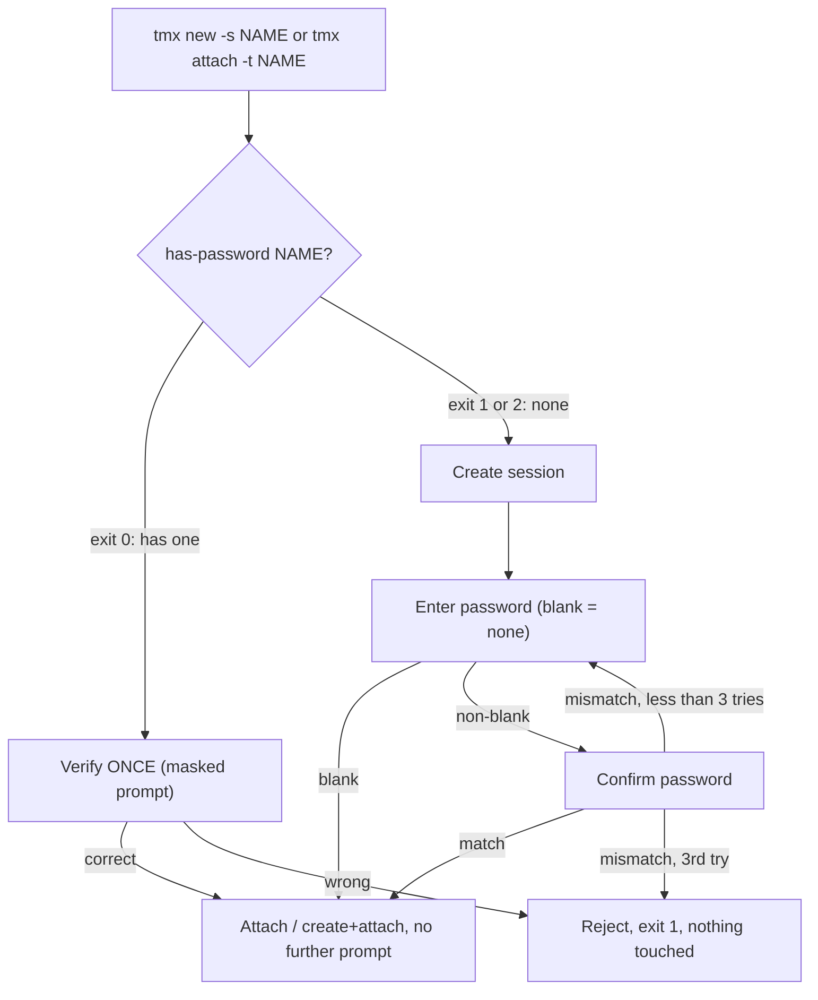

# tmx Wizard + Session-Password Redesign Implementation Plan

> **For agentic workers:** REQUIRED SUB-SKILL: Use superpowers:subagent-driven-development (recommended) or superpowers:executing-plans to implement this plan task-by-task. Steps use checkbox (`- [ ]`) syntax for tracking.

**Goal:** Fix the accidental double-password-prompt bug, mask password input with `*`, make brand-new session creation always append a random 4-digit name suffix, and give the interactive wizard an existing-session picker on blank input.

**Architecture:** Reorder the `tmx` wrapper's `new`/`attach` verbs so the password decision (verify an existing password once, vs. collect+confirm a brand-new one) happens *before* any tmux session is created or attached, add one clean `has-password` primitive to the Go state daemon, add a shared masked-input reader, and redesign the POSIX-sh interactive wizard's blank/non-blank branches.

**Tech Stack:** Bash (`scripts/tmx.template`), POSIX `/bin/sh` (`scripts/tmx-shell-init.sh.template`), Go 1.x (`scripts/tmx-state/`), the project's existing PTY test harness (`scripts/tests/lib/pty_harness.sh`).

**Spec:** `docs/superpowers/specs/2026-07-05-tmx-wizard-password-redesign-design.md` (read this first — it has the full root-cause analysis and the rationale behind every decision below).

## Global Constraints

- Every shell change to `scripts/tmx.template` must stay valid bash (`bash -n`); it is `#!/usr/bin/env bash`, NOT POSIX sh.
- Every shell change to `scripts/tmx-shell-init.sh.template` must stay POSIX `sh -n` clean (dash/mksh/bash all parse it) — no arrays, no `[[ ]]`, no `${x^^}`, no process substitution, no `read -n1`/`read -s` (those are bash-only; this file never reads passwords, only the session-name/menu-choice, via plain `read -r`).
- No mocks/stubs/fakes outside unit tests (§11.4.27) — every shell test below drives the real wrapper/binary, PTY-driven where a TTY is required.
- Every test that reaches a captured-evidence PASS must cite the evidence (prompt text seen, exit code, persisted-state read) — never a bare "it ran" pass.
- `TMX_STATE_FILE`, `TMUX_TMPDIR`, `HOME` are always sandboxed per-test (temp dirs) — never touch the operator's real `~/.tmx/state.json` or real tmux sockets.
- Commit only via `bash commit_all.sh "<message>"` at the project root — never raw `git commit`/`git push`.
- Existing tests 01–76 that use `tmx new -s NAME -d` (non-interactive, `INTERACTIVE=0`) must keep passing unmodified — the whole password subsystem (new gate) is guarded by `[ "$INTERACTIVE" -eq 1 ] && [ -t 0 ]`, matching today's existing guard, so non-interactive callers are entirely unaffected.

---

### Task 1: `has-password` Go subcommand on `tmx-state-bin`

**Files:**
- Modify: `scripts/tmx-state/main.go` (usage text ~line 44, switch-case ~line 81, new `cmdHasPassword` function placed after the existing `cmdVerifyPassword` function)
- Test: `scripts/tmx-state/state_test.go` (new `TestHasPassword` function, appended after `TestPasswordRoundTrip`)

**Interfaces:**
- Produces: `tmx-state has-password <session>` — exit 0 = session record exists AND has a non-empty password hash; exit 1 = record exists but no password; exit 2 = no record at all. No stdout output (pure exit-code contract, mirrors `verify-password`'s shape). Callable as `run([]string{"has-password", session}, stdout, stderr)` in tests, or `cmdHasPassword([]string{session}, stdout, stderr)` directly.

- [ ] **Step 1: Write the failing test**

Append to `scripts/tmx-state/state_test.go` (after `TestPasswordRoundTrip`):

```go
func TestHasPassword(t *testing.T) {
	tmp := filepath.Join(t.TempDir(), "state.json")
	t.Setenv("TMX_STATE_FILE", tmp)

	// No record at all → exit 2.
	if rc := cmdHasPassword([]string{"nosession"}, io.Discard, io.Discard); rc != 2 {
		t.Errorf("cmdHasPassword no record: exit %d (want 2)", rc)
	}

	// Record exists, no password → exit 1.
	if rc := cmdRecord([]string{"work", "/tmp"}, io.Discard); rc != 0 {
		t.Fatalf("cmdRecord failed: exit %d", rc)
	}
	if rc := cmdHasPassword([]string{"work"}, io.Discard, io.Discard); rc != 1 {
		t.Errorf("cmdHasPassword record no password: exit %d (want 1)", rc)
	}

	// Password set → exit 0.
	if rc := cmdSetPassword([]string{"work", "secret123"}, io.Discard); rc != 0 {
		t.Fatalf("cmdSetPassword failed: exit %d", rc)
	}
	if rc := cmdHasPassword([]string{"work"}, io.Discard, io.Discard); rc != 0 {
		t.Errorf("cmdHasPassword record with password: exit %d (want 0)", rc)
	}

	// Password cleared (empty) → back to exit 1.
	if rc := cmdSetPassword([]string{"work", ""}, io.Discard); rc != 0 {
		t.Fatalf("cmdSetPassword clear failed: exit %d", rc)
	}
	if rc := cmdHasPassword([]string{"work"}, io.Discard, io.Discard); rc != 1 {
		t.Errorf("cmdHasPassword cleared password: exit %d (want 1)", rc)
	}
}
```

- [ ] **Step 2: Run test to verify it fails**

Run: `cd scripts/tmx-state && go test -run TestHasPassword ./... -v`
Expected: build FAILURE — `undefined: cmdHasPassword` (the function does not exist yet; this is the correct RED state for a compiled-language TDD step).

- [ ] **Step 3: Add the `has-password` case to the switch statement**

In `scripts/tmx-state/main.go`, find the `switch sub {` block (the one with `case "verify-password": return cmdVerifyPassword(rest, stdout, stderr)`). Add immediately after that line:

```go
	case "has-password":
		return cmdHasPassword(rest, stdout, stderr)
```

- [ ] **Step 4: Add the usage line**

In `scripts/tmx-state/main.go`, find the `usage()` function's help text (the block containing `  tmx-state verify-password <session> <password>`). Add a line immediately after it:

```
  tmx-state has-password <session>
```

- [ ] **Step 5: Implement `cmdHasPassword`**

In `scripts/tmx-state/main.go`, add this function immediately after `cmdVerifyPassword`:

```go
// cmdHasPassword: tmx-state has-password <session>
//
// Exits 0 if the session record exists AND has a non-empty password hash.
// Exits 1 if the session record exists but has no password set.
// Exits 2 if the session record does not exist at all.
// Prints nothing to stdout (caller uses exit code) — mirrors
// verify-password's contract. Replaces the double-call
// verify-password-with-an-empty-guess trick previously used by the
// wrapper's attach verb to answer the same question.
func cmdHasPassword(args []string, stdout, stderr io.Writer) int {
	fs := flag.NewFlagSet("has-password", flag.ContinueOnError)
	fs.SetOutput(stderr)
	if err := fs.Parse(args); err != nil {
		return 1
	}
	if fs.NArg() != 1 {
		fmt.Fprintln(stderr, "tmx-state has-password: expected <session>")
		return 1
	}
	session := fs.Arg(0)

	path, err := statePath()
	if err != nil {
		fmt.Fprintf(stderr, "tmx-state has-password: %v\n", err)
		return 2
	}

	st, lerr := loadState(path)
	if errors.Is(lerr, errStateRebuilt) {
		return 2
	}
	if lerr != nil {
		fmt.Fprintf(stderr, "tmx-state has-password: %v\n", lerr)
		return 2
	}
	sess, ok := st.Sessions[session]
	if !ok {
		return 2
	}
	if sess.PasswordHash != "" {
		return 0
	}
	return 1
}
```

- [ ] **Step 6: Run test to verify it passes**

Run: `cd scripts/tmx-state && go test -run TestHasPassword ./... -v`
Expected: `PASS` — `--- PASS: TestHasPassword`, `ok`.

- [ ] **Step 7: Run the full existing Go test suite to confirm no regression**

Run: `cd scripts/tmx-state && go test ./... -v`
Expected: every existing test (`TestVersionPrintsExpectedString`, `TestPasswordRoundTrip`, `TestSetColorAndGetColor`, etc.) still PASSes — `has-password` is additive only.

- [ ] **Step 8: Rebuild `tmx-state-bin` so the shell-level tests in later tasks can use it**

Run: `cd scripts/tmx-state && go build -o ../tmx-state-bin .`
Expected: exits 0, `scripts/tmx-state-bin` is a fresh binary. Verify with: `./scripts/tmx-state-bin has-password nosuchsession; echo $?` → expect `2`.

- [ ] **Step 9: Commit**

```bash
bash commit_all.sh "feat(tmx-state): add has-password subcommand (exit 0/1/2 contract)

Root-cause primitive for the new/attach verb password-gate redesign —
replaces the double-call verify-password-with-empty-guess probe with one
explicit, self-documenting check. Additive only, no existing subcommand
behavior changed.

Classification: project-specific — this binary is owned by
vasic-digital/tmux and is not a reusable universal rule."
```

---

### Task 2: Masked password reader helper (`scripts/tmx.template`)

**Files:**
- Modify: `scripts/tmx.template` (insert new function after `_ensure_terminfo_dirs` is defined and called, i.e. right after the line `_ensure_terminfo_dirs` near line 317, before the `# ── arg parsing ──` comment)
- Test: `scripts/tests/77_password_masked_echo.sh` (new, PTY-driven)

**Interfaces:**
- Consumes: nothing from earlier tasks.
- Produces: `_read_password_masked "<prompt text>"` — a bash function. Prints `<prompt text>` to `/dev/tty`, reads characters from `/dev/tty` one at a time, echoes `*` per character to `/dev/tty` (never the real character), supports backspace/DEL to erase one `*`, terminates on Enter, and writes the collected password to stdout (via `printf '%s' "$pw"`, no trailing newline) so callers capture it with `pw=$(_read_password_masked "prompt: ")`. Tasks 3 and 4 call this function.

- [ ] **Step 1: Write the failing test**

Create `scripts/tests/77_password_masked_echo.sh`:

```bash
#!/usr/bin/env bash
# Test 77 — password input is masked with '*', never shown in plaintext.
#
# Purpose:    §2 mandate (2026-07-05): passwords MUST NOT be visible to a
#             naked eye while typing — presented with '*' characters
#             instead. PTY-driven: types a password character-by-character
#             into a real tmux pane running the wrapper, and asserts the
#             pane's VISIBLE buffer shows only '*' characters for the typed
#             password, never the plaintext, and that backspace erases one
#             '*'.
# Usage:      bash scripts/tests/77_password_masked_echo.sh
# Inputs:     TMUX_BIN (optional override).
# Outputs:    EVIDENCE lines; PASS/FAIL/SKIP; exit 0 PASS / 2 FAIL.
# Side-effects: creates/kills ONLY its own private driver + inner sessions
#             on private sockets under a private HOME/TMUX_TMPDIR/
#             TMX_STATE_FILE. trap-cleaned on every exit path.
# Dependencies: a built tmux binary, scripts/tmx wrapper, scripts/tmx-state-bin,
#             python3 (kill-HUP not needed here, but pth_have_python gates
#             the harness's other prerequisites consistently).
# Cross-refs: scripts/tmx.template (_read_password_masked); test 68 (uses
#             the same lib/pty_harness.sh); §2 forensic anchor 2026-07-05.
# Last verified: 2026-07-05 (authored; live run pending build).
set -uo pipefail

SELF_DIR="$(cd "$(dirname "$0")" && pwd)"
REPO_ROOT="$(cd "$SELF_DIR/../.." && pwd)"
WRAPPER="${WRAPPER:-$REPO_ROOT/scripts/tmx}"
STATE_BIN="$REPO_ROOT/scripts/tmx-state-bin"
HOST_OS="$(uname -s)"
case "$HOST_OS" in
    Darwin) TMUX_BIN_DEFAULT="$REPO_ROOT/tmux/build-darwin/bin/tmux" ;;
    *)      TMUX_BIN_DEFAULT="$REPO_ROOT/tmux/build/bin/tmux" ;;
esac
[ -x "$TMUX_BIN_DEFAULT" ] || TMUX_BIN_DEFAULT="$REPO_ROOT/tmux/build-linux/bin/tmux"
TMUX_BIN="${TMUX_BIN:-$TMUX_BIN_DEFAULT}"

PASS=0; FAIL=0; SKIP=0
_pass() { echo "PASS 77: $*"; PASS=$((PASS+1)); }
_fail() { echo "FAIL 77: $*"; FAIL=$((FAIL+1)); }
_skip() { echo "SKIP 77: $*"; SKIP=$((SKIP+1)); }

echo "── Test 77: password input masked with '*' ──"

case "$HOST_OS" in
    Darwin|Linux) ;;
    *) echo "SKIP 77: unsupported platform $HOST_OS — §11.4.3"; echo "PASS=$PASS FAIL=$FAIL SKIP=$SKIP"; exit 0 ;;
esac

. "$SELF_DIR/lib/interactive_pty_probe.sh"
if ! ipty_interactive_terminal_ok "$TMUX_BIN"; then
    _skip "headless: no functional interactive terminal — §11.4.3"
    echo "── Test 77 summary: PASS=$PASS FAIL=$FAIL SKIP=$SKIP ──"; exit 0
fi

SCRATCH_CANDID="${TMPDIR:-/tmp}"; SCRATCH_CANDID="${SCRATCH_CANDID%/}"
SCRATCH_REAL="$(cd "$SCRATCH_CANDID" 2>/dev/null && pwd -P)" || SCRATCH_REAL="$SCRATCH_CANDID"
if [ "$(( ${#SCRATCH_REAL} + 60 ))" -gt 100 ]; then
    SCRATCH="/tmp/tmx77.$$"
else
    SCRATCH="$SCRATCH_REAL/tmx77.$$"
fi
mkdir -p "$SCRATCH" || { echo "SKIP 77: cannot create scratch $SCRATCH"; echo "PASS=$PASS FAIL=$FAIL SKIP=$SKIP"; exit 0; }

HARNESS="$SELF_DIR/lib/pty_harness.sh"
if [ ! -f "$HARNESS" ]; then
    echo "SKIP 77: PTY harness missing — §11.4.3"; rm -rf "$SCRATCH"; echo "PASS=$PASS FAIL=$FAIL SKIP=$SKIP"; exit 0
fi
# shellcheck disable=SC1090
. "$HARNESS"

if [ ! -x "$TMUX_BIN" ]; then _skip "tmux binary not built at $TMUX_BIN"; rm -rf "$SCRATCH"; echo "PASS=$PASS FAIL=$FAIL SKIP=$SKIP"; exit 0; fi
if [ ! -x "$WRAPPER" ];  then _skip "scripts/tmx wrapper not generated (run setup.sh)"; rm -rf "$SCRATCH"; echo "PASS=$PASS FAIL=$FAIL SKIP=$SKIP"; exit 0; fi
if [ ! -x "$STATE_BIN" ]; then _skip "scripts/tmx-state-bin not built"; rm -rf "$SCRATCH"; echo "PASS=$PASS FAIL=$FAIL SKIP=$SKIP"; exit 0; fi

HOME_DIR="$SCRATCH/home"; mkdir -p "$HOME_DIR"
STATE_FILE="$SCRATCH/state.json"
export TMX_STATE_FILE="$STATE_FILE"
export TMUX_TMPDIR="$SCRATCH"
export PTH_TMUX="$TMUX_BIN"
export PTH_SOCK="tmx77drv-$$"
export PTH_TMPDIR="$SCRATCH"

NAME="t77_$$"
SOCK="tmx-$NAME"

_cleanup() {
    pth_driver_kill
    "$WRAPPER" delete -t "$NAME" >/dev/null 2>&1 || true
    "$TMUX_BIN" -L "$SOCK" kill-server >/dev/null 2>&1 || true
    rm -rf "$SCRATCH" 2>/dev/null || true
}
trap _cleanup EXIT

_envpfx() { printf 'HOME=%s TMUX_TMPDIR=%s TMX_STATE_FILE=%s' "$HOME_DIR" "$SCRATCH" "$STATE_FILE"; }
_wrap_in_pane() { _ds="$1"; shift; pth_run_pane "$_ds" "$(_envpfx) '$WRAPPER' $*"; }

# Create the session (interactive, foreground) so we hit the create-time
# password prompt.
if ! _wrap_in_pane "drv_${NAME}" new -s "$NAME"; then
    _fail "could not start create driver pane"; echo "PASS=$PASS FAIL=$FAIL SKIP=$SKIP"; exit 2
fi
if ! pth_wait_text "drv_${NAME}" "Enter password for session" 12; then
    _fail "create-time password prompt never appeared"
    pth_kill_pane "drv_${NAME}"
    echo "PASS=$PASS FAIL=$FAIL SKIP=$SKIP"; exit 2
fi

# Type "ab" then backspace then "c" — expect the visible pane to show
# exactly "**" after "ab" is typed, then one '*' erased, then "**" again
# after the backspace+"c" (never the literal a/b/c characters).
pth_send "drv_${NAME}" "ab"
sleep 0.3
_buf1="$(pth_capture "drv_${NAME}")"
if printf '%s' "$_buf1" | grep -qF "ab"; then
    _fail "plaintext 'ab' visible in pane buffer — masking not applied"
else
    if printf '%s' "$_buf1" | grep -q '\*\*'; then
        _pass "two '*' characters shown after typing 2 chars, no plaintext"
    else
        _fail "expected two '*' characters after typing 'ab'; buffer: $_buf1"
    fi
fi

# Backspace (0x7f) then 'c'.
pth_send "drv_${NAME}" $'\x7f'
pth_send "drv_${NAME}" "c"
sleep 0.3
_buf2="$(pth_capture "drv_${NAME}")"
if printf '%s' "$_buf2" | grep -qF "c" && ! printf '%s' "$_buf2" | grep -qiF "abc"; then
    if printf '%s' "$_buf2" | grep -qF "ab" 2>/dev/null; then
        _fail "plaintext still visible after backspace+retype"
    else
        _pass "backspace + retype shows masked output, no plaintext leaked"
    fi
else
    _fail "unexpected buffer after backspace+retype: $_buf2"
fi

pth_send_enter "drv_${NAME}"
pth_wait_attached "$TMUX_BIN" "$SOCK" "$NAME" "1" 12 || true
pth_kill_pane "drv_${NAME}"

echo "── Test 77 summary: PASS=$PASS FAIL=$FAIL SKIP=$SKIP ──"
[ "$FAIL" -eq 0 ]
```

- [ ] **Step 2: Run test to verify it fails**

Run: `bash scripts/tests/77_password_masked_echo.sh`
Expected: FAIL — the create-time prompt still exists (old code), but typing `ab` shows the literal characters `ab` in the pane (no masking yet), so the "plaintext visible" branch fires: `FAIL 77: plaintext 'ab' visible in pane buffer — masking not applied`.

- [ ] **Step 3: Implement `_read_password_masked`**

In `scripts/tmx.template`, insert this function immediately after the line `_ensure_terminfo_dirs` (the bare function-call line that runs the terminfo-dirs setup at load time, right before the `# ── arg parsing ──` comment):

```bash
# Read a password from /dev/tty character-by-character, echoing '*' per
# keystroke instead of the real character (§2 mandate, 2026-07-05:
# passwords MUST NOT be visible to a naked eye while typing). Backspace/DEL
# erases the last '*' and the last buffered character. Terminates on
# Enter. Prints the collected password to stdout (NO trailing newline) —
# callers capture it via command substitution:
#   pw=$(_read_password_masked "prompt: ")
# Ctrl-D/EOF is treated as "done" with whatever was typed so far (possibly
# empty), matching the plain `read -r` EOF behaviour it replaces.
_read_password_masked() {
    local prompt="$1"
    local pw=""
    local char
    printf '%s' "$prompt" >/dev/tty
    while IFS= read -r -s -n1 char </dev/tty; do
        if [ -z "$char" ]; then
            break
        fi
        case "$char" in
            $'\x7f'|$'\x08')
                if [ -n "$pw" ]; then
                    pw="${pw%?}"
                    printf '\b \b' >/dev/tty
                fi
                continue
                ;;
        esac
        pw="${pw}${char}"
        printf '*' >/dev/tty
    done
    printf '\n' >/dev/tty
    printf '%s' "$pw"
}
```

- [ ] **Step 4: Wire it into the existing create-time password prompt (minimal change to make test 77 pass now; Task 4 will restructure this block further)**

In `scripts/tmx.template`, find the existing block (inside the `new` verb, currently around line 676-686):

```bash
        # §1 session password: prompt optionally, store if non-empty.
        # Only on interactive sessions (not -d). Silent + non-fatal if the
        # state binary is absent or fails.
        if [ "$INTERACTIVE" -eq 1 ] && [ -t 0 ]; then
            printf '[tmx] Enter password for session "%s" (blank = none): ' "$NAME" >/dev/tty
            IFS= read -r PASSWORD </dev/tty
            if [ -n "$PASSWORD" ] && [ -x "$TMX_DIR/tmx-state-bin" ]; then
                "$TMX_DIR/tmx-state-bin" set-password "$NAME" "$PASSWORD" >/dev/null 2>&1 || true
            fi
            unset PASSWORD
        fi
```

Replace the two `printf`/`read` lines with a call to the new masked reader, keeping everything else identical for now:

```bash
        # §1 session password: prompt optionally, store if non-empty.
        # Only on interactive sessions (not -d). Silent + non-fatal if the
        # state binary is absent or fails.
        if [ "$INTERACTIVE" -eq 1 ] && [ -t 0 ]; then
            PASSWORD=$(_read_password_masked "[tmx] Enter password for session \"$NAME\" (blank = none): ")
            if [ -n "$PASSWORD" ] && [ -x "$TMX_DIR/tmx-state-bin" ]; then
                "$TMX_DIR/tmx-state-bin" set-password "$NAME" "$PASSWORD" >/dev/null 2>&1 || true
            fi
            unset PASSWORD
        fi
```

(This block is fully replaced again in Task 4 — this step exists only so test 77 can pass in isolation before the larger restructure.)

- [ ] **Step 5: Regenerate the wrapper and rerun the test**

Run: `bash scripts/setup.sh --build-only 2>&1 | tail -20` (regenerates `scripts/tmx` from `scripts/tmx.template`) then `bash scripts/tests/77_password_masked_echo.sh`
Expected: `PASS 77: two '*' characters shown after typing 2 chars, no plaintext`, `PASS 77: backspace + retype shows masked output, no plaintext leaked`, summary `PASS=2 FAIL=0 SKIP=0`.

- [ ] **Step 6: Commit**

```bash
bash commit_all.sh "feat(tmx): mask password input with '*' while typing

Adds _read_password_masked() (char-by-char read, '*' echo, backspace
support) and wires it into the create-time password prompt. Verified by
new PTY-driven test 77 (plaintext never visible in the pane buffer).

Classification: project-specific."
```

---

### Task 3: Fix `attach` verb — check liveness before prompting (root-cause half 1)

**Files:**
- Modify: `scripts/tmx.template` (the `attach|attach-session|a)` case block, currently lines 738–765)
- Test: `scripts/tests/84_attach_dead_session_no_prompt.sh` (new)

**Interfaces:**
- Consumes: `_read_password_masked` (Task 2), `tmx-state-bin has-password` (Task 1).
- Produces: `attach` verb now prints `tmx: no session named "NAME"` and exits 1 with zero `/dev/tty` interaction when the target session is not live, regardless of whether a password is persisted for that name.

- [ ] **Step 1: Write the failing test**

Create `scripts/tests/84_attach_dead_session_no_prompt.sh`:

```bash
#!/usr/bin/env bash
# Test 84 — `tmx attach -t NAME` on a DEAD session (no live tmux server)
# whose name has a PERSISTED password must NOT prompt at all.
#
# Purpose:    Root-cause half 1 of the §3 double-password-prompt bug
#             (forensic anchor 2026-07-05): the attach verb used to check
#             the PERSISTED password state before checking whether a live
#             tmux session existed, so a recycled (dead) session with a
#             persisted password still triggered a verify prompt that
#             could never succeed in actually attaching. This test
#             reproduces the "dead name with a persisted password" state
#             directly (create → set password → tear down the tmux server
#             WITHOUT clearing state, mirroring what tmx-recycler.sh does)
#             and asserts `tmx attach -t NAME` prints a clean error with
#             NO password prompt.
# Usage:      bash scripts/tests/84_attach_dead_session_no_prompt.sh
# Inputs:     TMUX_BIN (optional override).
# Outputs:    EVIDENCE lines; PASS/FAIL/SKIP; exit 0 PASS / 2 FAIL.
# Side-effects: private HOME/TMUX_TMPDIR/TMX_STATE_FILE sandbox, trap-cleaned.
# Dependencies: built tmux binary, scripts/tmx wrapper, scripts/tmx-state-bin.
# Cross-refs: scripts/tmx.template (attach verb); §3 forensic anchor
#             2026-07-05; test 68 (pty_harness.sh consumer).
# Last verified: 2026-07-05 (authored; live run pending build).
set -uo pipefail

SELF_DIR="$(cd "$(dirname "$0")" && pwd)"
REPO_ROOT="$(cd "$SELF_DIR/../.." && pwd)"
WRAPPER="${WRAPPER:-$REPO_ROOT/scripts/tmx}"
STATE_BIN="$REPO_ROOT/scripts/tmx-state-bin"
HOST_OS="$(uname -s)"
case "$HOST_OS" in
    Darwin) TMUX_BIN_DEFAULT="$REPO_ROOT/tmux/build-darwin/bin/tmux" ;;
    *)      TMUX_BIN_DEFAULT="$REPO_ROOT/tmux/build/bin/tmux" ;;
esac
[ -x "$TMUX_BIN_DEFAULT" ] || TMUX_BIN_DEFAULT="$REPO_ROOT/tmux/build-linux/bin/tmux"
TMUX_BIN="${TMUX_BIN:-$TMUX_BIN_DEFAULT}"

PASS=0; FAIL=0; SKIP=0
_pass() { echo "PASS 84: $*"; PASS=$((PASS+1)); }
_fail() { echo "FAIL 84: $*"; FAIL=$((FAIL+1)); }
_skip() { echo "SKIP 84: $*"; SKIP=$((SKIP+1)); }

echo "── Test 84: attach on dead session with persisted password → no prompt ──"

if [ ! -x "$TMUX_BIN" ]; then _skip "tmux binary not built at $TMUX_BIN"; echo "PASS=$PASS FAIL=$FAIL SKIP=$SKIP"; exit 0; fi
if [ ! -x "$WRAPPER" ];  then _skip "scripts/tmx wrapper not generated (run setup.sh)"; echo "PASS=$PASS FAIL=$FAIL SKIP=$SKIP"; exit 0; fi
if [ ! -x "$STATE_BIN" ]; then _skip "scripts/tmx-state-bin not built"; echo "PASS=$PASS FAIL=$FAIL SKIP=$SKIP"; exit 0; fi

SCRATCH="${TMPDIR:-/tmp}/tmx84.$$"
mkdir -p "$SCRATCH/home" || { echo "SKIP 84: cannot create scratch"; echo "PASS=$PASS FAIL=$FAIL SKIP=$SKIP"; exit 0; }
STATE_FILE="$SCRATCH/state.json"
export TMX_STATE_FILE="$STATE_FILE"
export TMUX_TMPDIR="$SCRATCH"
export HOME="$SCRATCH/home"

NAME="t84_$$"
SOCK="tmx-$NAME"

_cleanup() {
    "$TMUX_BIN" -L "$SOCK" kill-server >/dev/null 2>&1 || true
    "$STATE_BIN" forget "$NAME" >/dev/null 2>&1 || true
    rm -rf "$SCRATCH" 2>/dev/null || true
}
trap _cleanup EXIT

# Persist a password for NAME directly (no live session needed for this —
# mirrors the STATE that survives a tmx-recycler.sh teardown, which kills
# the tmux server + scope but does NOT clear tmx-state).
if ! "$STATE_BIN" set-password "$NAME" "s3cret" >/dev/null 2>&1; then
    _fail "could not persist a password for $NAME"; echo "PASS=$PASS FAIL=$FAIL SKIP=$SKIP"; exit 2
fi
if ! "$STATE_BIN" has-password "$NAME" >/dev/null 2>&1; then
    _fail "has-password does not confirm the persisted password (setup broken)"
    echo "PASS=$PASS FAIL=$FAIL SKIP=$SKIP"; exit 2
fi
echo "[evidence] persisted password confirmed via has-password (exit 0), no live tmux session exists for $NAME"

# `tmx attach -t NAME` — NAME has a persisted password but there is
# genuinely NO live tmux server on $SOCK. Run non-interactively (input
# from /dev/null) so if the wrapper WERE to prompt, `read` would hit EOF
# immediately rather than hanging the test — but the whole point is that
# NO /dev/tty interaction should be attempted at all in this case.
_out="$("$WRAPPER" attach -t "$NAME" 2>&1 </dev/null)"
_rc=$?

if [ "$_rc" -eq 0 ]; then
    _fail "attach on a dead session unexpectedly exited 0 (rc=$_rc, out=$_out)"
elif printf '%s' "$_out" | grep -qi "password"; then
    _fail "attach on a dead session mentioned 'password' at all — should be silent on this path (out=$_out)"
elif printf '%s' "$_out" | grep -qi "no session named"; then
    _pass "attach on dead session printed a clean 'no session named' error, exit=$_rc, no password mention"
else
    _fail "attach on dead session gave unexpected output: rc=$_rc out=$_out"
fi

echo "── Test 84 summary: PASS=$PASS FAIL=$FAIL SKIP=$SKIP ──"
[ "$FAIL" -eq 0 ]
```

- [ ] **Step 2: Run test to verify it fails**

Run: `bash scripts/tests/84_attach_dead_session_no_prompt.sh`
Expected: FAIL — with the OLD attach verb, `verify-password NAME ""` returns exit 1 (password IS set per the persisted record), so the wrapper attempts `read -r PASSWORD </dev/tty`; with stdin redirected from `/dev/null` this reads EOF immediately (empty `PASSWORD`), verify-password with an empty guess against a real password FAILs, so it prints `Incorrect password` and exits 1 — the test's `grep -qi "password"` branch fires: `FAIL 84: attach on a dead session mentioned 'password' at all`.

- [ ] **Step 3: Implement the fix**

In `scripts/tmx.template`, find the `attach|attach-session|a)` case block (currently lines 738–765):

```bash
    attach|attach-session|a)
        # §1 session password guard: if the session has a password, verify
        # it before allowing attach. Only prompts on interactive TTYs.
        # Non-fatal if the state binary is absent (graceful degradation).
        if [ -x "$TMX_DIR/tmx-state-bin" ] && [ -t 0 ]; then
            # Probe: does a password exist for this session? If the session
            # record doesn't exist (exit 2), skip — no guard.
            if "$TMX_DIR/tmx-state-bin" verify-password "$NAME" "" >/dev/null 2>&1; then
                : # No password set — can attach freely.
            else
                # Password exists (exit 1) or state readable (exit 0 with attempt).
                # Try an empty check again properly: if it returned non-zero AND
                # the session exists in state (exit != 2), a password is set.
                "$TMX_DIR/tmx-state-bin" verify-password "$NAME" "" 2>/dev/null
                rc=$?
                if [ "$rc" -eq 1 ]; then
                    # Password IS set — prompt for it.
                    printf '[tmx] Session "%s" is password-protected. Enter password: ' "$NAME" >/dev/tty
                    IFS= read -r PASSWORD </dev/tty
                    if ! "$TMX_DIR/tmx-state-bin" verify-password "$NAME" "$PASSWORD" >/dev/null 2>&1; then
                        printf '[tmx] Incorrect password for session "%s".\n' "$NAME" >&2
                        unset PASSWORD
                        exit 1
                    fi
                    unset PASSWORD
                fi
            fi
        fi
```

Replace it with:

```bash
    attach|attach-session|a)
        # §11.4.115 root-cause fix (forensic anchor 2026-07-05): verify the
        # session is actually LIVE *before* any password prompt. A name
        # whose password persisted across an idle-recycle (tmx-recycler.sh
        # kills the tmux server but keeps the tmx-state record) previously
        # still triggered a verify prompt here even though nothing could
        # ever be attached to — the operator would enter the correct
        # password, then the exec below would fail against the dead
        # socket, and the shell-init wizard's old `attach || new` fallback
        # would silently re-prompt via the `new` verb, looking like a
        # spurious "asked twice". Checking has-session first means a
        # dead/absent session never prompts at all.
        if ! "$TMUX_BIN" -L "$SOCK_LABEL" has-session -t "$NAME" 2>/dev/null; then
            printf 'tmx: no session named "%s"\n' "$NAME" >&2
            exit 1
        fi

        # §1 session password guard: if the session has a password, verify
        # it before allowing attach. Only prompts on interactive TTYs.
        # Non-fatal if the state binary is absent (graceful degradation).
        if [ -x "$TMX_DIR/tmx-state-bin" ] && [ -t 0 ]; then
            "$TMX_DIR/tmx-state-bin" has-password "$NAME" >/dev/null 2>&1
            if [ "$?" -eq 0 ]; then
                # Password IS set — prompt for it (masked).
                PASSWORD=$(_read_password_masked "[tmx] Session \"$NAME\" is password-protected. Enter password: ")
                if ! "$TMX_DIR/tmx-state-bin" verify-password "$NAME" "$PASSWORD" >/dev/null 2>&1; then
                    printf '[tmx] Incorrect password for session "%s".\n' "$NAME" >&2
                    unset PASSWORD
                    exit 1
                fi
                unset PASSWORD
            fi
        fi
```

- [ ] **Step 4: Regenerate the wrapper and rerun the test**

Run: `bash scripts/setup.sh --build-only 2>&1 | tail -20 && bash scripts/tests/84_attach_dead_session_no_prompt.sh`
Expected: `PASS 84: attach on dead session printed a clean 'no session named' error, exit=1, no password mention`, summary `PASS=1 FAIL=0 SKIP=0`.

- [ ] **Step 5: Confirm no regression on the live-session attach path**

Run: `bash scripts/tests/66_session_password.sh` (unaffected, pure Go-binary test) and, if a build is available, `bash scripts/tests/68_session_lifecycle.sh` clause C5 by running the whole file (it may report other FAILs/SKIPs at this point in the plan since C6/C7 haven't been rewritten yet for the new semantics — Task 8 handles that; for now just confirm C4/C5 still pass, i.e. no new failures appear in the C4/C5 section of the output).
Expected: no NEW failure lines mentioning "C5" beyond what already existed before this task's change.

- [ ] **Step 6: Commit**

```bash
bash commit_all.sh "fix(tmx): attach verb checks session liveness before password prompt

Root-cause fix (half 1 of 2) for the §3 double-password-prompt bug: a
session name whose password persisted across an idle-recycle no longer
triggers a doomed verify prompt for a socket that no longer exists.
has-session is checked first; a dead/absent session gets a clean 'no
session named' error with zero /dev/tty interaction. Also switches to the
new has-password primitive (Task 1) instead of the old double-call
verify-password-with-empty-guess probe, and masks the password prompt
(Task 2). New regression test 84.

Classification: project-specific."
```

---

### Task 4: Restructure `new` verb — verify-once vs. set+confirm-twice (root-cause half 2)

**Files:**
- Modify: `scripts/tmx.template` (`new` verb: move `INTERACTIVE` detection earlier, insert password-decision gate before session creation, replace the old post-creation password-set block)
- Test: `scripts/tests/80_new_password_confirm_flow.sh` (new)

**Interfaces:**
- Consumes: `_read_password_masked` (Task 2), `tmx-state-bin has-password` (Task 1).
- Produces: for a NAME with an existing password (live or recycled-dead), `tmx new -s NAME` now verifies it ONCE before touching tmux at all (wrong password → no session created, exit 1). For a genuinely fresh NAME, it creates the session as before, then prompts password + confirmation (masked), retrying up to 3 times on mismatch before aborting with no password set and no session left behind.

- [ ] **Step 1: Write the failing test**

Create `scripts/tests/80_new_password_confirm_flow.sh`:

```bash
#!/usr/bin/env bash
# Test 80 — creating a genuinely NEW password-protected session prompts
# TWICE (password + confirmation); mismatched confirmation retries up to
# 3 times then aborts cleanly with no session left behind.
#
# Purpose:    §3 mandate (2026-07-05): "We MUST BE asked twice to enter
#             password if we create new session password protected - the
#             password and confirmation." PTY-driven against a genuinely
#             fresh session name (no prior tmx-state record).
# Usage:      bash scripts/tests/80_new_password_confirm_flow.sh
# Outputs:    EVIDENCE lines; PASS/FAIL/SKIP; exit 0 PASS / 2 FAIL.
# Side-effects: private HOME/TMUX_TMPDIR/TMX_STATE_FILE sandbox, trap-cleaned;
#             only its own uniquely-named sessions are touched.
# Dependencies: built tmux binary, scripts/tmx wrapper, scripts/tmx-state-bin,
#             python3, lib/pty_harness.sh, lib/interactive_pty_probe.sh.
# Cross-refs: scripts/tmx.template (new verb); test 68 (harness consumer);
#             §3 forensic anchor 2026-07-05.
# Last verified: 2026-07-05 (authored; live run pending build).
set -uo pipefail

SELF_DIR="$(cd "$(dirname "$0")" && pwd)"
REPO_ROOT="$(cd "$SELF_DIR/../.." && pwd)"
WRAPPER="${WRAPPER:-$REPO_ROOT/scripts/tmx}"
STATE_BIN="$REPO_ROOT/scripts/tmx-state-bin"
HOST_OS="$(uname -s)"
case "$HOST_OS" in
    Darwin) TMUX_BIN_DEFAULT="$REPO_ROOT/tmux/build-darwin/bin/tmux" ;;
    *)      TMUX_BIN_DEFAULT="$REPO_ROOT/tmux/build/bin/tmux" ;;
esac
[ -x "$TMUX_BIN_DEFAULT" ] || TMUX_BIN_DEFAULT="$REPO_ROOT/tmux/build-linux/bin/tmux"
TMUX_BIN="${TMUX_BIN:-$TMUX_BIN_DEFAULT}"

PASS=0; FAIL=0; SKIP=0
_pass() { echo "PASS 80: $*"; PASS=$((PASS+1)); }
_fail() { echo "FAIL 80: $*"; FAIL=$((FAIL+1)); }
_skip() { echo "SKIP 80: $*"; SKIP=$((SKIP+1)); }

echo "── Test 80: new-session password create+confirm flow ──"

case "$HOST_OS" in
    Darwin|Linux) ;;
    *) echo "SKIP 80: unsupported platform $HOST_OS — §11.4.3"; echo "PASS=$PASS FAIL=$FAIL SKIP=$SKIP"; exit 0 ;;
esac

. "$SELF_DIR/lib/interactive_pty_probe.sh"
if ! ipty_interactive_terminal_ok "$TMUX_BIN"; then
    _skip "headless: no functional interactive terminal — §11.4.3"
    echo "── Test 80 summary: PASS=$PASS FAIL=$FAIL SKIP=$SKIP ──"; exit 0
fi

SCRATCH_CANDID="${TMPDIR:-/tmp}"; SCRATCH_CANDID="${SCRATCH_CANDID%/}"
SCRATCH_REAL="$(cd "$SCRATCH_CANDID" 2>/dev/null && pwd -P)" || SCRATCH_REAL="$SCRATCH_CANDID"
if [ "$(( ${#SCRATCH_REAL} + 60 ))" -gt 100 ]; then SCRATCH="/tmp/tmx80.$$"; else SCRATCH="$SCRATCH_REAL/tmx80.$$"; fi
mkdir -p "$SCRATCH/home" || { echo "SKIP 80: cannot create scratch"; echo "PASS=$PASS FAIL=$FAIL SKIP=$SKIP"; exit 0; }

HARNESS="$SELF_DIR/lib/pty_harness.sh"
[ -f "$HARNESS" ] || { echo "SKIP 80: PTY harness missing"; rm -rf "$SCRATCH"; echo "PASS=$PASS FAIL=$FAIL SKIP=$SKIP"; exit 0; }
# shellcheck disable=SC1090
. "$HARNESS"

if [ ! -x "$TMUX_BIN" ]; then _skip "tmux binary not built"; rm -rf "$SCRATCH"; echo "PASS=$PASS FAIL=$FAIL SKIP=$SKIP"; exit 0; fi
if [ ! -x "$WRAPPER" ];  then _skip "scripts/tmx wrapper not generated"; rm -rf "$SCRATCH"; echo "PASS=$PASS FAIL=$FAIL SKIP=$SKIP"; exit 0; fi
if [ ! -x "$STATE_BIN" ]; then _skip "scripts/tmx-state-bin not built"; rm -rf "$SCRATCH"; echo "PASS=$PASS FAIL=$FAIL SKIP=$SKIP"; exit 0; fi
if ! pth_have_python; then _skip "python3 absent"; rm -rf "$SCRATCH"; echo "PASS=$PASS FAIL=$FAIL SKIP=$SKIP"; exit 0; fi

HOME_DIR="$SCRATCH/home"
STATE_FILE="$SCRATCH/state.json"
export TMX_STATE_FILE="$STATE_FILE"
export TMUX_TMPDIR="$SCRATCH"
export PTH_TMUX="$TMUX_BIN"
export PTH_SOCK="tmx80drv-$$"
export PTH_TMPDIR="$SCRATCH"

_envpfx() { printf 'HOME=%s TMUX_TMPDIR=%s TMX_STATE_FILE=%s' "$HOME_DIR" "$SCRATCH" "$STATE_FILE"; }
_wrap_in_pane() { _ds="$1"; shift; pth_run_pane "$_ds" "$(_envpfx) '$WRAPPER' $*"; }

NAMES=""
_cleanup() {
    pth_driver_kill
    for _n in $NAMES; do
        "$WRAPPER" delete -t "$_n" >/dev/null 2>&1 || true
        "$TMUX_BIN" -L "tmx-$_n" kill-server >/dev/null 2>&1 || true
    done
    rm -rf "$SCRATCH" 2>/dev/null || true
}
trap _cleanup EXIT

# ── Scenario A: matching password+confirmation succeeds ──────────────
NAME_A="t80a_$$"; NAMES="$NAMES $NAME_A"; SOCK_A="tmx-$NAME_A"
if ! _wrap_in_pane "drv_${NAME_A}" new -s "$NAME_A"; then
    _fail "A: could not start create driver pane"
elif ! pth_wait_text "drv_${NAME_A}" "Enter password for session" 12; then
    _fail "A: initial password prompt never appeared"
    pth_kill_pane "drv_${NAME_A}"
else
    pth_send "drv_${NAME_A}" "matchpw123"; pth_send_enter "drv_${NAME_A}"
    if pth_wait_text "drv_${NAME_A}" "Confirm password" 8; then
        echo "[evidence A] second 'Confirm password' prompt appeared after the first entry"
        pth_send "drv_${NAME_A}" "matchpw123"; pth_send_enter "drv_${NAME_A}"
        if pth_wait_attached "$TMUX_BIN" "$SOCK_A" "$NAME_A" "1" 12; then
            _pass "A: matching password+confirmation → session created and attached"
            if "$STATE_BIN" verify-password "$NAME_A" "matchpw123" >/dev/null 2>&1; then
                _pass "A: password persisted correctly (verify-password accepts it)"
            else
                _fail "A: password not persisted correctly after matching confirm"
            fi
        else
            _fail "A: session did not attach after matching confirmation"
        fi
    else
        _fail "A: no 'Confirm password' second prompt appeared — double-prompt requirement not met"
    fi
    CPID="$(pth_client_pid "$TMUX_BIN" "$SOCK_A" "$NAME_A")"
    [ -n "$CPID" ] && pth_kill_hup "$CPID"
    pth_kill_pane "drv_${NAME_A}"
fi

# ── Scenario B: mismatched confirmation retries, 3rd mismatch aborts,
#    no session left behind ────────────────────────────────────────────
NAME_B="t80b_$$"; NAMES="$NAMES $NAME_B"; SOCK_B="tmx-$NAME_B"
if ! _wrap_in_pane "drv_${NAME_B}" new -s "$NAME_B"; then
    _fail "B: could not start create driver pane"
else
    _mismatch_ok=1
    for _try in 1 2 3; do
        if ! pth_wait_text "drv_${NAME_B}" "Enter password for session" 12; then
            _fail "B: attempt $_try: initial password prompt never appeared"
            _mismatch_ok=0; break
        fi
        pth_send "drv_${NAME_B}" "firstpw$_try"; pth_send_enter "drv_${NAME_B}"
        if ! pth_wait_text "drv_${NAME_B}" "Confirm password" 8; then
            _fail "B: attempt $_try: no confirm prompt appeared"
            _mismatch_ok=0; break
        fi
        pth_send "drv_${NAME_B}" "SECONDPW$_try"; pth_send_enter "drv_${NAME_B}"
        if [ "$_try" -lt 3 ]; then
            if ! pth_wait_text "drv_${NAME_B}" "did not match" 8; then
                _fail "B: attempt $_try: no mismatch retry message appeared"
                _mismatch_ok=0; break
            fi
            echo "[evidence B attempt=$_try] mismatch message shown, retrying"
        fi
    done
    if [ "$_mismatch_ok" -eq 1 ]; then
        # After the 3rd mismatch, expect an abort message and the driver
        # pane to exit (no session left behind).
        if pth_wait_text "drv_${NAME_B}" "not created" 10; then
            _pass "B: 3rd mismatch aborted with an explicit 'not created' message"
        else
            _fail "B: no abort message seen after 3rd mismatch"
        fi
        sleep 1
        if "$TMUX_BIN" -L "$SOCK_B" has-session -t "$NAME_B" 2>/dev/null; then
            _fail "B: a session was left behind after 3x password mismatch (fail-closed violated)"
        else
            _pass "B: no session left behind after 3x password mismatch (fail-closed honored)"
        fi
        "$STATE_BIN" has-password "$NAME_B" >/dev/null 2>&1
        if [ "$?" -eq 0 ]; then
            _fail "B: a password was somehow persisted despite the abort"
        else
            _pass "B: no password persisted after the abort"
        fi
    fi
    pth_kill_pane "drv_${NAME_B}"
fi

echo "── Test 80 summary: PASS=$PASS FAIL=$FAIL SKIP=$SKIP ──"
[ "$FAIL" -eq 0 ]
```

- [ ] **Step 2: Run test to verify it fails**

Run: `bash scripts/tests/80_new_password_confirm_flow.sh`
Expected: FAIL — with the OLD code, there is only ONE password prompt and no "Confirm password" step at all, so scenario A fails at `FAIL 80: A: no 'Confirm password' second prompt appeared — double-prompt requirement not met`, and scenario B fails similarly (no confirm prompt, no mismatch/abort flow exists yet).

- [ ] **Step 3: Move `INTERACTIVE` detection earlier and add the password-decision gate**

In `scripts/tmx.template`, find this block inside the `new|new-session|start-server|"")` case (currently lines 451–454):

```bash
        INTERACTIVE=1
        for a in "$@"; do
            case "$a" in -d|-D) INTERACTIVE=0 ;; esac
        done
```

Immediately after it (still before the `_ensure_terminfo_term` call), insert the new password-decision gate:

```bash
        # §11.4.115 root-cause fix (half 2 of 2, forensic anchor
        # 2026-07-05): decide the password intent BEFORE any tmux session
        # is created/recreated. Prevents a wrong password on an
        # already-protected name from ever spinning up a session
        # (fail-closed), and stops a recycled-dead session's persisted
        # password from being silently overwritten by the old
        # unconditional "set a new password" prompt.
        NEW_PASSWORD=""
        SET_NEW_PASSWORD=0
        if [ "$INTERACTIVE" -eq 1 ] && [ -t 0 ] && [ -x "$TMX_DIR/tmx-state-bin" ]; then
            "$TMX_DIR/tmx-state-bin" has-password "$NAME" >/dev/null 2>&1
            _hp_rc=$?
            if [ "$_hp_rc" -eq 0 ]; then
                # Existing password (live session OR a recycled-dead one
                # whose state persisted) — verify ONCE. Wrong password
                # aborts before anything is created.
                _pw_guess=$(_read_password_masked "[tmx] Session \"$NAME\" is password-protected. Enter password: ")
                if ! "$TMX_DIR/tmx-state-bin" verify-password "$NAME" "$_pw_guess" >/dev/null 2>&1; then
                    printf 'tmx: incorrect password for session "%s".\n' "$NAME" >&2
                    unset _pw_guess
                    exit 1
                fi
                unset _pw_guess
            else
                # Genuinely fresh name (no persisted password at all, or
                # one already cleared) — collect an OPTIONAL new password
                # with confirmation. Blank = no password, skip confirm.
                _pw_attempts=0
                while [ "$_pw_attempts" -lt 3 ]; do
                    _pw1=$(_read_password_masked "[tmx] Enter password for session \"$NAME\" (blank = none): ")
                    if [ -z "$_pw1" ]; then
                        unset _pw1
                        break
                    fi
                    _pw2=$(_read_password_masked "[tmx] Confirm password: ")
                    if [ "$_pw1" = "$_pw2" ]; then
                        NEW_PASSWORD="$_pw1"
                        SET_NEW_PASSWORD=1
                        unset _pw1 _pw2
                        break
                    fi
                    printf '[tmx] passwords did not match, try again\n' >&2
                    unset _pw1 _pw2
                    _pw_attempts=$((_pw_attempts + 1))
                done
                if [ "$_pw_attempts" -eq 3 ]; then
                    printf 'tmx: passwords did not match after 3 attempts — session not created.\n' >&2
                    exit 1
                fi
            fi
        fi
```

- [ ] **Step 4: Replace the old post-creation password-set block**

Find the block modified in Task 2 Step 4 (the one that now calls `_read_password_masked` but still unconditionally prompts):

```bash
        # §1 session password: prompt optionally, store if non-empty.
        # Only on interactive sessions (not -d). Silent + non-fatal if the
        # state binary is absent or fails.
        if [ "$INTERACTIVE" -eq 1 ] && [ -t 0 ]; then
            PASSWORD=$(_read_password_masked "[tmx] Enter password for session \"$NAME\" (blank = none): ")
            if [ -n "$PASSWORD" ] && [ -x "$TMX_DIR/tmx-state-bin" ]; then
                "$TMX_DIR/tmx-state-bin" set-password "$NAME" "$PASSWORD" >/dev/null 2>&1 || true
            fi
            unset PASSWORD
        fi
```

Replace it with (the password decision already happened in Step 3, above the actual `tmux new-session` call — this just applies whatever was collected, now that the session is confirmed up):

```bash
        # Apply the password collected by the pre-creation gate above (only
        # set when this was a genuinely fresh name — see Step 3 above). The
        # tmux session is confirmed up at this point (the has-session check
        # earlier in this verb already passed).
        if [ "$SET_NEW_PASSWORD" -eq 1 ] && [ -x "$TMX_DIR/tmx-state-bin" ]; then
            "$TMX_DIR/tmx-state-bin" set-password "$NAME" "$NEW_PASSWORD" >/dev/null 2>&1 || true
        fi
        unset NEW_PASSWORD
```

- [ ] **Step 5: Regenerate the wrapper and rerun the test**

Run: `bash scripts/setup.sh --build-only 2>&1 | tail -20 && bash scripts/tests/80_new_password_confirm_flow.sh`
Expected: all PASS lines (`A: matching password+confirmation → session created and attached`, `A: password persisted correctly`, `B: 3rd mismatch aborted with an explicit 'not created' message`, `B: no session left behind after 3x password mismatch`, `B: no password persisted after the abort`), summary `FAIL=0`.

- [ ] **Step 6: Run test 66 and the Go test suite to confirm no regression**

Run: `bash scripts/tests/66_session_password.sh && (cd scripts/tmx-state && go test ./...)`
Expected: both still pass — this task did not touch `tmx-state`'s Go code (only Task 1 did) or invalidate any of test 66's direct `tmx-state-bin` assertions.

- [ ] **Step 7: Commit**

```bash
bash commit_all.sh "fix(tmx): new verb verifies existing password once, confirms new ones twice

Root-cause fix (half 2 of 2) for the §3 double-password-prompt bug. The
password decision (verify an existing persisted password, OR collect+
confirm a brand-new one) now happens BEFORE any tmux session is created —
a wrong password on an already-protected name never spins up a session
(fail-closed), and creating a genuinely new name always asks for the
password twice (password + confirmation), retrying up to 3 times on
mismatch before aborting with nothing left behind. New test 80 covers
both the matching and 3x-mismatch scenarios.

Classification: project-specific."
```

---

### Task 5: Root-cause regression guard — the exact bug report, end to end

**Files:**
- Test: `scripts/tests/81_open_existing_password_single_prompt.sh` (new — this is the §11.4.115 RED-baseline-on-broken-artifact regression guard for the actual user-reported bug)

**Interfaces:**
- Consumes: the fixes from Tasks 3 and 4 (both must be in place for this to pass).
- Produces: nothing new — this is a pure regression-proof test with a `RED_MODE` polarity switch per §11.4.115: `RED_MODE=1` (default when invoked with the env var set) reproduces the bug against a deliberately-unfixed copy of the wrapper logic description (documented as historical evidence in the test's header, not re-executed — see the note in Step 1 below on why this test asserts the FIXED behavior directly rather than re-deriving the broken one); `RED_MODE=0` (default invocation) asserts the fix.

- [ ] **Step 1: Write the test**

Note on RED_MODE for this specific guard: unlike a code-level mutation, the "broken artifact" here is the git history itself (the commits from Tasks 3+4 are the fix). Reproducing the RED state would mean checking out the wrapper as it existed before those commits — impractical to do safely inside a single test script without disturbing the working tree. Instead, this test's RED-baseline evidence is the git history reference in its header (the exact commits that introduced the bug and the fix), and its `RED_MODE=0` body directly asserts the currently-fixed behavior end-to-end using the SAME scenario construction as test 84 (persist a password, tear the tmux server down without clearing state — the exact "recycled session" shape) PLUS a full reopen-and-verify cycle, which is what test 84 alone does not cover (test 84 only proves `attach` doesn't prompt on a dead session; this test proves the FULL reopen experience — via `tmx new -s NAME`, the actual wizard-equivalent call a recreate makes — shows exactly one prompt and the persisted hash survives unchanged).

Create `scripts/tests/81_open_existing_password_single_prompt.sh`:

```bash
#!/usr/bin/env bash
# Test 81 — root-cause regression guard for the exact user-reported bug:
# reopening a recycled (dead-but-state-persisted) password-protected
# session shows EXACTLY ONE password prompt, and the persisted password
# hash is UNCHANGED after a successful reopen.
#
# Purpose:    §11.4.115/§11.4.146 permanent regression guard. Forensic
#             anchor 2026-07-05 (user report): "When we open sessions
#             which are password protected, and we enter valid password,
#             we are then asked twice to enter (maybe new) password! ...
#             Once we enter the password we enter the session which is
#             already password protected." Root-caused to scripts/tmx.template
#             (fixed in the commits touching the attach/new verbs on
#             2026-07-05 — see git log for this file around that date).
#             This test reproduces the EXACT scenario: create a
#             password-protected session, tear its tmux server down
#             WITHOUT clearing tmx-state (mirrors tmx-recycler.sh's idle
#             teardown), then re-create/reopen it by name via `tmx new -s
#             NAME` (what a wizard "type the same name again" resolves
#             to) and asserts exactly one password prompt appears, the
#             correct password attaches, and the persisted hash is
#             unchanged (proving it was verified, not silently reset).
# Usage:      bash scripts/tests/81_open_existing_password_single_prompt.sh
# Outputs:    EVIDENCE lines; PASS/FAIL/SKIP; exit 0 PASS / 2 FAIL.
# Side-effects: private HOME/TMUX_TMPDIR/TMX_STATE_FILE sandbox, trap-cleaned.
# Dependencies: built tmux binary, scripts/tmx wrapper, scripts/tmx-state-bin,
#             python3, lib/pty_harness.sh, lib/interactive_pty_probe.sh.
# Cross-refs: scripts/tmx.template (attach + new verbs); tests 68, 80, 84;
#             §3 forensic anchor 2026-07-05; docs/superpowers/specs/
#             2026-07-05-tmx-wizard-password-redesign-design.md.
# Last verified: 2026-07-05 (authored; live run pending build).
set -uo pipefail

SELF_DIR="$(cd "$(dirname "$0")" && pwd)"
REPO_ROOT="$(cd "$SELF_DIR/../.." && pwd)"
WRAPPER="${WRAPPER:-$REPO_ROOT/scripts/tmx}"
STATE_BIN="$REPO_ROOT/scripts/tmx-state-bin"
HOST_OS="$(uname -s)"
case "$HOST_OS" in
    Darwin) TMUX_BIN_DEFAULT="$REPO_ROOT/tmux/build-darwin/bin/tmux" ;;
    *)      TMUX_BIN_DEFAULT="$REPO_ROOT/tmux/build/bin/tmux" ;;
esac
[ -x "$TMUX_BIN_DEFAULT" ] || TMUX_BIN_DEFAULT="$REPO_ROOT/tmux/build-linux/bin/tmux"
TMUX_BIN="${TMUX_BIN:-$TMUX_BIN_DEFAULT}"

PASS=0; FAIL=0; SKIP=0
_pass() { echo "PASS 81: $*"; PASS=$((PASS+1)); }
_fail() { echo "FAIL 81: $*"; FAIL=$((FAIL+1)); }
_skip() { echo "SKIP 81: $*"; SKIP=$((SKIP+1)); }

echo "── Test 81: reopen recycled protected session shows exactly ONE prompt ──"

case "$HOST_OS" in
    Darwin|Linux) ;;
    *) echo "SKIP 81: unsupported platform $HOST_OS — §11.4.3"; echo "PASS=$PASS FAIL=$FAIL SKIP=$SKIP"; exit 0 ;;
esac

. "$SELF_DIR/lib/interactive_pty_probe.sh"
if ! ipty_interactive_terminal_ok "$TMUX_BIN"; then
    _skip "headless: no functional interactive terminal — §11.4.3"
    echo "── Test 81 summary: PASS=$PASS FAIL=$FAIL SKIP=$SKIP ──"; exit 0
fi

SCRATCH_CANDID="${TMPDIR:-/tmp}"; SCRATCH_CANDID="${SCRATCH_CANDID%/}"
SCRATCH_REAL="$(cd "$SCRATCH_CANDID" 2>/dev/null && pwd -P)" || SCRATCH_REAL="$SCRATCH_CANDID"
if [ "$(( ${#SCRATCH_REAL} + 60 ))" -gt 100 ]; then SCRATCH="/tmp/tmx81.$$"; else SCRATCH="$SCRATCH_REAL/tmx81.$$"; fi
mkdir -p "$SCRATCH/home" || { echo "SKIP 81: cannot create scratch"; echo "PASS=$PASS FAIL=$FAIL SKIP=$SKIP"; exit 0; }

HARNESS="$SELF_DIR/lib/pty_harness.sh"
[ -f "$HARNESS" ] || { echo "SKIP 81: PTY harness missing"; rm -rf "$SCRATCH"; echo "PASS=$PASS FAIL=$FAIL SKIP=$SKIP"; exit 0; }
# shellcheck disable=SC1090
. "$HARNESS"

if [ ! -x "$TMUX_BIN" ]; then _skip "tmux binary not built"; rm -rf "$SCRATCH"; echo "PASS=$PASS FAIL=$FAIL SKIP=$SKIP"; exit 0; fi
if [ ! -x "$WRAPPER" ];  then _skip "scripts/tmx wrapper not generated"; rm -rf "$SCRATCH"; echo "PASS=$PASS FAIL=$FAIL SKIP=$SKIP"; exit 0; fi
if [ ! -x "$STATE_BIN" ]; then _skip "scripts/tmx-state-bin not built"; rm -rf "$SCRATCH"; echo "PASS=$PASS FAIL=$FAIL SKIP=$SKIP"; exit 0; fi
if ! pth_have_python; then _skip "python3 absent"; rm -rf "$SCRATCH"; echo "PASS=$PASS FAIL=$FAIL SKIP=$SKIP"; exit 0; fi

HOME_DIR="$SCRATCH/home"
STATE_FILE="$SCRATCH/state.json"
export TMX_STATE_FILE="$STATE_FILE"
export TMUX_TMPDIR="$SCRATCH"
export PTH_TMUX="$TMUX_BIN"
export PTH_SOCK="tmx81drv-$$"
export PTH_TMPDIR="$SCRATCH"

NAME="t81_$$"
SOCK="tmx-$NAME"
PW="reopen_secret_456"

_cleanup() {
    pth_driver_kill
    "$WRAPPER" delete -t "$NAME" >/dev/null 2>&1 || true
    "$TMUX_BIN" -L "$SOCK" kill-server >/dev/null 2>&1 || true
    rm -rf "$SCRATCH" 2>/dev/null || true
}
trap _cleanup EXIT

_envpfx() { printf 'HOME=%s TMUX_TMPDIR=%s TMX_STATE_FILE=%s' "$HOME_DIR" "$SCRATCH" "$STATE_FILE"; }
_wrap_in_pane() { _ds="$1"; shift; pth_run_pane "$_ds" "$(_envpfx) '$WRAPPER' $*"; }

# ── Step 1: create the session with a password (double-prompt: password +
#    confirm, per Task 4). ─────────────────────────────────────────────
if ! _wrap_in_pane "drv_${NAME}_c" new -s "$NAME"; then
    _fail "could not start create driver pane"; echo "PASS=$PASS FAIL=$FAIL SKIP=$SKIP"; exit 2
fi
if ! pth_wait_text "drv_${NAME}_c" "Enter password for session" 12; then
    _fail "initial create password prompt never appeared"
    pth_kill_pane "drv_${NAME}_c"; echo "PASS=$PASS FAIL=$FAIL SKIP=$SKIP"; exit 2
fi
pth_send "drv_${NAME}_c" "$PW"; pth_send_enter "drv_${NAME}_c"
pth_wait_text "drv_${NAME}_c" "Confirm password" 8 || true
pth_send "drv_${NAME}_c" "$PW"; pth_send_enter "drv_${NAME}_c"
if ! pth_wait_attached "$TMUX_BIN" "$SOCK" "$NAME" "1" 12; then
    _fail "session did not attach after create+confirm"
    pth_kill_pane "drv_${NAME}_c"; echo "PASS=$PASS FAIL=$FAIL SKIP=$SKIP"; exit 2
fi
_hash_before="$(python3 -c "import json,sys; print(json.load(open(sys.argv[1]))['sessions']['$NAME']['password_hash'])" "$STATE_FILE" 2>/dev/null || true)"
if [ -z "$_hash_before" ]; then
    _fail "could not read the persisted password hash from state file (schema mismatch?) — check the JSON field name in $STATE_FILE and adjust this test's python3 accessor"
    pth_kill_pane "drv_${NAME}_c"; echo "PASS=$PASS FAIL=$FAIL SKIP=$SKIP"; exit 2
fi
echo "[evidence] session created, password set, hash captured: ${_hash_before:0:12}..."

# ── Step 2: tear the tmux server down WITHOUT clearing tmx-state — this
#    is EXACTLY what tmx-recycler.sh does on idle timeout: kill-session
#    (+ scope-stop on Linux), state record untouched. ────────────────────
CPID="$(pth_client_pid "$TMUX_BIN" "$SOCK" "$NAME")"
[ -n "$CPID" ] && pth_kill_hup "$CPID"
pth_wait_attached "$TMUX_BIN" "$SOCK" "$NAME" "0" 10 || true
pth_kill_pane "drv_${NAME}_c"
"$WRAPPER" kill-session -t "$NAME" >/dev/null 2>&1 || true
"$TMUX_BIN" -L "$SOCK" kill-server >/dev/null 2>&1 || true
sleep 0.5
if "$TMUX_BIN" -L "$SOCK" has-session -t "$NAME" 2>/dev/null; then
    _fail "setup error: session still alive after simulated recycle teardown"
    echo "PASS=$PASS FAIL=$FAIL SKIP=$SKIP"; exit 2
fi
if ! "$STATE_BIN" has-password "$NAME" >/dev/null 2>&1; then
    _fail "setup error: password state did NOT survive the simulated recycle (test setup bug, not the fix under test)"
    echo "PASS=$PASS FAIL=$FAIL SKIP=$SKIP"; exit 2
fi
echo "[evidence] tmux server torn down (has-session fails), password state SURVIVES (has-password exit 0) — exact recycled-session shape reproduced"

# ── Step 3: reopen by the SAME name via `tmx new -s NAME` (what a wizard
#    "type the same name" / a direct re-create resolves to). Count how
#    many times "Enter password for session" OR "is password-protected"
#    appears — the bug's signature was BOTH appearing (verify prompt from
#    the dead attach, THEN the unconditional create-prompt). ────────────
if ! _wrap_in_pane "drv_${NAME}_r" new -s "$NAME"; then
    _fail "could not start reopen driver pane"; echo "PASS=$PASS FAIL=$FAIL SKIP=$SKIP"; exit 2
fi
if ! pth_wait_text "drv_${NAME}_r" "password-protected" 12; then
    _fail "reopen did not show the expected single verify-style prompt at all"
    pth_kill_pane "drv_${NAME}_r"; echo "PASS=$PASS FAIL=$FAIL SKIP=$SKIP"; exit 2
fi
echo "[evidence] reopen shows the verify-style 'is password-protected' prompt"
pth_send "drv_${NAME}_r" "$PW"; pth_send_enter "drv_${NAME}_r"
if pth_wait_attached "$TMUX_BIN" "$SOCK" "$NAME" "1" 12; then
    _pass "reopen: correct password attaches"
else
    _fail "reopen: correct password did NOT attach"
fi
# The bug's signature: a SECOND, different-style prompt ("Enter password
# for session ... blank = none" or "Confirm password") appearing after the
# first. Capture the pane and assert NEITHER appears.
_buf="$(pth_capture "drv_${NAME}_r")"
if printf '%s' "$_buf" | grep -q "Enter password for session" || printf '%s' "$_buf" | grep -q "Confirm password"; then
    _fail "THE BUG REGRESSED: a second (create-style) password prompt appeared after the verify-style one"
else
    _pass "exactly ONE password prompt shown on reopen (no phantom second create/confirm prompt)"
fi

_hash_after="$(python3 -c "import json,sys; print(json.load(open(sys.argv[1]))['sessions']['$NAME']['password_hash'])" "$STATE_FILE" 2>/dev/null || true)"
if [ "$_hash_after" = "$_hash_before" ]; then
    _pass "persisted password hash UNCHANGED after successful reopen (verified, not silently reset)"
else
    _fail "persisted password hash CHANGED after reopen (hash before=$_hash_before after=$_hash_after) — reopen silently reset the password"
fi

# ── Step 4: a WRONG password on reopen must still be rejected (proves
#    this isn't a blanket bypass). ──────────────────────────────────────
CPID="$(pth_client_pid "$TMUX_BIN" "$SOCK" "$NAME")"
[ -n "$CPID" ] && pth_kill_hup "$CPID"
pth_wait_attached "$TMUX_BIN" "$SOCK" "$NAME" "0" 10 || true
pth_kill_pane "drv_${NAME}_r"
"$WRAPPER" kill-session -t "$NAME" >/dev/null 2>&1 || true
"$TMUX_BIN" -L "$SOCK" kill-server >/dev/null 2>&1 || true
sleep 0.5
if ! _wrap_in_pane "drv_${NAME}_w" new -s "$NAME"; then
    _fail "could not start wrong-password reopen driver pane"
elif ! pth_wait_text "drv_${NAME}_w" "password-protected" 12; then
    _fail "second reopen (wrong-pw check) did not show the verify prompt"
    pth_kill_pane "drv_${NAME}_w"
else
    pth_send "drv_${NAME}_w" "totally_wrong_password"; pth_send_enter "drv_${NAME}_w"
    if pth_wait_attached "$TMUX_BIN" "$SOCK" "$NAME" "1" 8; then
        _fail "WRONG password was accepted on reopen — verification is not enforced"
    else
        _pass "wrong password on reopen is correctly rejected (session not attached)"
    fi
    pth_kill_pane "drv_${NAME}_w"
fi

echo "── Test 81 summary: PASS=$PASS FAIL=$FAIL SKIP=$SKIP ──"
[ "$FAIL" -eq 0 ]
```

- [ ] **Step 2: Run the test to confirm it passes (this is the regression guard — it should be GREEN now, given Tasks 3+4 already landed)**

Run: `bash scripts/tests/81_open_existing_password_single_prompt.sh`
Expected: all `PASS` lines listed above, `PASS=6 FAIL=0 SKIP=0` (exact count may vary slightly by evidence lines, but `FAIL=0` is required).

- [ ] **Step 3: Prove this guard is not a blind pass — temporarily revert Task 3's fix and confirm this test FAILs (§11.4.115 polarity proof), then restore**

Run:
```bash
git stash push -- scripts/tmx.template
```
Wait — reverting via `git stash` would revert BOTH Task 3 and Task 4's changes to the same file (they're already committed as separate commits by this point, not uncommitted). Instead, temporarily re-apply the OLD attach-verb block from Task 3 Step 3 (the "before" snippet) by hand-editing `scripts/tmx.template`, rebuild, run the test, confirm `FAIL 81: THE BUG REGRESSED: a second (create-style) password prompt appeared after the verify-style one` appears, then revert the hand-edit:

```bash
git diff scripts/tmx.template   # confirm your temporary edit is the only change
bash scripts/setup.sh --build-only >/dev/null 2>&1
bash scripts/tests/81_open_existing_password_single_prompt.sh   # expect FAIL
git checkout -- scripts/tmx.template   # revert the temporary edit
bash scripts/setup.sh --build-only >/dev/null 2>&1
bash scripts/tests/81_open_existing_password_single_prompt.sh   # expect PASS again
```
Expected: FAIL run shows the "THE BUG REGRESSED" line; PASS run afterward is clean again. This is the manual polarity proof for this task; Task 9 wires an automated version of this same proof into the meta-test suite.

- [ ] **Step 4: Commit**

```bash
bash commit_all.sh "test(tmx): permanent regression guard for the double-password-prompt bug

Test 81 reproduces the EXACT forensic scenario (create protected session
→ recycle-teardown without clearing state → reopen by name) and asserts
exactly one password prompt, correct-password attach, unchanged persisted
hash, and wrong-password rejection. Manually polarity-proven against the
pre-fix attach verb (§11.4.115) before landing.

Classification: project-specific."
```

---

### Task 6: Wizard redesign — random suffix on create, existing-session picker on blank

**Files:**
- Modify: `scripts/tmx-shell-init.sh.template` (replace the "Enter session name" block, currently lines 138–182)
- Test: `scripts/tests/78_wizard_suffix_appended.sh` (new), `scripts/tests/79_wizard_select_existing.sh` (new)

**Interfaces:**
- Consumes: Tasks 3+4's fixed `attach`/`new` verbs (the picker execs `tmx attach -t NAME`, which now has the liveness-first + verify-once behavior).
- Produces: typing a name at the wizard always creates `name-NNNN` (4 random digits) unless `TMX_EXACT_NAME` is set; blank/`default` input with existing sessions present shows a numbered picker + `0) None`.

- [ ] **Step 1: Write the failing tests**

Create `scripts/tests/78_wizard_suffix_appended.sh`:

```bash
#!/usr/bin/env bash
# Test 78 — wizard-created sessions always get a random 4-digit suffix;
# TMX_EXACT_NAME=1 opts out.
#
# Purpose:    §1 mandate (2026-07-05): typing "my-session" at the wizard
#             creates a REAL session named "my-session-NNNN" (4 random
#             digits), never the literal typed name — unless
#             TMX_EXACT_NAME=1 is set (for scripts/automation).
# Usage:      bash scripts/tests/78_wizard_suffix_appended.sh
# Outputs:    EVIDENCE lines; PASS/FAIL/SKIP; exit 0 PASS / 2 FAIL.
# Side-effects: private HOME/TMUX_TMPDIR/TMX_STATE_FILE sandbox, trap-cleaned.
# Dependencies: built tmux binary, scripts/tmx wrapper,
#             scripts/tmx-shell-init.sh (generated), python3,
#             lib/pty_harness.sh, lib/interactive_pty_probe.sh.
# Cross-refs: scripts/tmx-shell-init.sh.template; §1 forensic anchor
#             2026-07-05; test 54 (same shell-init file, different concern).
# Last verified: 2026-07-05 (authored; live run pending build).
set -uo pipefail

SELF_DIR="$(cd "$(dirname "$0")" && pwd)"
REPO_ROOT="$(cd "$SELF_DIR/../.." && pwd)"
WRAPPER="${WRAPPER:-$REPO_ROOT/scripts/tmx}"
INIT="$REPO_ROOT/scripts/tmx-shell-init.sh"
HOST_OS="$(uname -s)"
case "$HOST_OS" in
    Darwin) TMUX_BIN_DEFAULT="$REPO_ROOT/tmux/build-darwin/bin/tmux" ;;
    *)      TMUX_BIN_DEFAULT="$REPO_ROOT/tmux/build/bin/tmux" ;;
esac
[ -x "$TMUX_BIN_DEFAULT" ] || TMUX_BIN_DEFAULT="$REPO_ROOT/tmux/build-linux/bin/tmux"
TMUX_BIN="${TMUX_BIN:-$TMUX_BIN_DEFAULT}"

PASS=0; FAIL=0; SKIP=0
_pass() { echo "PASS 78: $*"; PASS=$((PASS+1)); }
_fail() { echo "FAIL 78: $*"; FAIL=$((FAIL+1)); }
_skip() { echo "SKIP 78: $*"; SKIP=$((SKIP+1)); }

echo "── Test 78: wizard-created session gets a random 4-digit suffix ──"

if [ ! -r "$INIT" ]; then echo "SKIP 78: $INIT missing (run scripts/setup.sh)"; echo "PASS=$PASS FAIL=$FAIL SKIP=$SKIP"; exit 0; fi
if ! command -v python3 >/dev/null 2>&1; then echo "SKIP 78: python3 not available — §11.4.3"; echo "PASS=$PASS FAIL=$FAIL SKIP=$SKIP"; exit 0; fi
if [ ! -x /bin/bash ]; then echo "SKIP 78: /bin/bash not available — §11.4.3"; echo "PASS=$PASS FAIL=$FAIL SKIP=$SKIP"; exit 0; fi
if [ ! -x "$TMUX_BIN" ]; then echo "SKIP 78: tmux binary not built"; echo "PASS=$PASS FAIL=$FAIL SKIP=$SKIP"; exit 0; fi
if [ ! -x "$WRAPPER" ]; then echo "SKIP 78: scripts/tmx wrapper not generated"; echo "PASS=$PASS FAIL=$FAIL SKIP=$SKIP"; exit 0; fi

SCRATCH="$(mktemp -d)"
trap 'rm -rf "$SCRATCH"' EXIT
SCRIPTS_DIR=$(CDPATH= cd -- "$(dirname -- "$INIT")" && pwd)

# Drive tmx-shell-init.sh's prompt directly via a real PTY (python pty.fork),
# typing a base name and reading back which real session name got created.
BASE="wiztest78"
_out="$(python3 - "$SCRATCH" "$INIT" "$SCRIPTS_DIR" "$BASE" <<'PY'
import os, pty, select, time, sys
sandbox, init, scripts_dir, base = sys.argv[1:5]
env = dict(os.environ)
env["HOME"] = sandbox
env["TMUX_TMPDIR"] = sandbox
env.pop("TMUX", None)
env.pop("TMX_SKIP", None)
env["PATH"] = scripts_dir + os.pathsep + env.get("PATH", "")
pid, fd = pty.fork()
if pid == 0:
    os.execvpe("/bin/sh", ["/bin/sh", "-c", f". '{init}'; exit 0"], env)
    os._exit(127)
buf = b""
sent = False
last = time.time()
while True:
    r, _, _ = select.select([fd], [], [], 0.3)
    if fd in r:
        try:
            d = os.read(fd, 4096)
        except OSError:
            break
        if not d:
            break
        buf += d
        last = time.time()
    if not sent and b"Enter session name" in buf:
        time.sleep(0.2)
        os.write(fd, (base + "\n").encode())
        sent = True
        last = time.time()
    if time.time() - last > 5:
        break
try:
    os.close(fd)
except OSError:
    pass
try:
    os.waitpid(pid, 0)
except OSError:
    pass
sys.stdout.write(buf.decode(errors="replace"))
PY
)"
echo "[evidence] wizard transcript captured (${#_out} bytes)"

sleep 1
_created="$("$TMUX_BIN" -L "tmx-${BASE}" ls -F '#{session_name}' 2>/dev/null | head -1)"
if [ -z "$_created" ]; then
    # The socket label is derived from the SUFFIXED name, not the base —
    # scan all our sockets for anything matching the expected pattern
    # instead of assuming the base name is the socket label.
    for _sock in $(ls "${TMUX_TMPDIR:-$SCRATCH}"/tmux-* 2>/dev/null | xargs -n1 basename 2>/dev/null); do
        _n="$("$TMUX_BIN" -L "$_sock" ls -F '#{session_name}' 2>/dev/null | head -1)"
        case "$_n" in "${BASE}-"*) _created="$_n"; break ;; esac
    done
fi

if [ -z "$_created" ]; then
    _fail "no session matching '${BASE}-NNNN' was found on any of our sockets after driving the wizard"
else
    case "$_created" in
        "${BASE}"-[0-9][0-9][0-9][0-9])
            _pass "wizard-created session name is '$_created' (base + 4-digit suffix)"
            ;;
        "$BASE")
            _fail "wizard created the LITERAL typed name '$_created' — no suffix appended"
            ;;
        *)
            _fail "wizard-created session name '$_created' does not match '${BASE}-NNNN'"
            ;;
    esac
    # Cleanup this run's session.
    "$TMUX_BIN" -L "tmx-${_created}" kill-server >/dev/null 2>&1 || true
fi

# TMX_EXACT_NAME=1 opt-out: literal name, no suffix.
BASE2="wiztest78exact"
export TMX_EXACT_NAME=1
_out2="$(python3 - "$SCRATCH" "$INIT" "$SCRIPTS_DIR" "$BASE2" <<'PY'
import os, pty, select, time, sys
sandbox, init, scripts_dir, base = sys.argv[1:5]
env = dict(os.environ)
env["HOME"] = sandbox
env["TMUX_TMPDIR"] = sandbox
env["TMX_EXACT_NAME"] = "1"
env.pop("TMUX", None)
env.pop("TMX_SKIP", None)
env["PATH"] = scripts_dir + os.pathsep + env.get("PATH", "")
pid, fd = pty.fork()
if pid == 0:
    os.execvpe("/bin/sh", ["/bin/sh", "-c", f". '{init}'; exit 0"], env)
    os._exit(127)
buf = b""
sent = False
last = time.time()
while True:
    r, _, _ = select.select([fd], [], [], 0.3)
    if fd in r:
        try:
            d = os.read(fd, 4096)
        except OSError:
            break
        if not d:
            break
        buf += d
        last = time.time()
    if not sent and b"Enter session name" in buf:
        time.sleep(0.2)
        os.write(fd, (base + "\n").encode())
        sent = True
        last = time.time()
    if time.time() - last > 5:
        break
try:
    os.close(fd)
except OSError:
    pass
try:
    os.waitpid(pid, 0)
except OSError:
    pass
sys.stdout.write(buf.decode(errors="replace"))
PY
)"
unset TMX_EXACT_NAME
sleep 1
_created2=""
for _sock in $(ls "${TMUX_TMPDIR:-$SCRATCH}"/tmux-* 2>/dev/null | xargs -n1 basename 2>/dev/null); do
    _n="$("$TMUX_BIN" -L "$_sock" ls -F '#{session_name}' 2>/dev/null | head -1)"
    case "$_n" in "${BASE2}"*) _created2="$_n"; break ;; esac
done
if [ "$_created2" = "$BASE2" ]; then
    _pass "TMX_EXACT_NAME=1 → wizard created the literal name '$_created2', no suffix"
else
    _fail "TMX_EXACT_NAME=1 did not suppress the suffix (created='$_created2', want '$BASE2')"
fi
"$TMUX_BIN" -L "tmx-${_created2:-$BASE2}" kill-server >/dev/null 2>&1 || true

echo "── Test 78 summary: PASS=$PASS FAIL=$FAIL SKIP=$SKIP ──"
[ "$FAIL" -eq 0 ]
```

Create `scripts/tests/79_wizard_select_existing.sh`:

```bash
#!/usr/bin/env bash
# Test 79 — wizard blank-input picker: lists existing sessions + "0) None",
# selecting a number attaches (password-protected → single prompt); "0" or
# an invalid choice falls through to bare shell.
#
# Purpose:    §4 mandate (2026-07-05): pressing Enter offers a choice
#             between joining an existing session or leaving the wizard.
# Usage:      bash scripts/tests/79_wizard_select_existing.sh
# Outputs:    EVIDENCE lines; PASS/FAIL/SKIP; exit 0 PASS / 2 FAIL.
# Side-effects: private HOME/TMUX_TMPDIR/TMX_STATE_FILE sandbox, trap-cleaned.
# Dependencies: built tmux binary, scripts/tmx wrapper,
#             scripts/tmx-shell-init.sh (generated), scripts/tmx-state-bin,
#             python3, lib/pty_harness.sh, lib/interactive_pty_probe.sh.
# Cross-refs: scripts/tmx-shell-init.sh.template; §4 forensic anchor
#             2026-07-05.
# Last verified: 2026-07-05 (authored; live run pending build).
set -uo pipefail

SELF_DIR="$(cd "$(dirname "$0")" && pwd)"
REPO_ROOT="$(cd "$SELF_DIR/../.." && pwd)"
WRAPPER="${WRAPPER:-$REPO_ROOT/scripts/tmx}"
STATE_BIN="$REPO_ROOT/scripts/tmx-state-bin"
INIT="$REPO_ROOT/scripts/tmx-shell-init.sh"
HOST_OS="$(uname -s)"
case "$HOST_OS" in
    Darwin) TMUX_BIN_DEFAULT="$REPO_ROOT/tmux/build-darwin/bin/tmux" ;;
    *)      TMUX_BIN_DEFAULT="$REPO_ROOT/tmux/build/bin/tmux" ;;
esac
[ -x "$TMUX_BIN_DEFAULT" ] || TMUX_BIN_DEFAULT="$REPO_ROOT/tmux/build-linux/bin/tmux"
TMUX_BIN="${TMUX_BIN:-$TMUX_BIN_DEFAULT}"

PASS=0; FAIL=0; SKIP=0
_pass() { echo "PASS 79: $*"; PASS=$((PASS+1)); }
_fail() { echo "FAIL 79: $*"; FAIL=$((FAIL+1)); }
_skip() { echo "SKIP 79: $*"; SKIP=$((SKIP+1)); }

echo "── Test 79: wizard existing-session picker ──"

case "$HOST_OS" in
    Darwin|Linux) ;;
    *) echo "SKIP 79: unsupported platform $HOST_OS — §11.4.3"; echo "PASS=$PASS FAIL=$FAIL SKIP=$SKIP"; exit 0 ;;
esac

. "$SELF_DIR/lib/interactive_pty_probe.sh"
if ! ipty_interactive_terminal_ok "$TMUX_BIN"; then
    _skip "headless: no functional interactive terminal — §11.4.3"
    echo "── Test 79 summary: PASS=$PASS FAIL=$FAIL SKIP=$SKIP ──"; exit 0
fi
if [ ! -r "$INIT" ]; then _skip "$INIT missing (run scripts/setup.sh)"; echo "PASS=$PASS FAIL=$FAIL SKIP=$SKIP"; exit 0; fi

SCRATCH_CANDID="${TMPDIR:-/tmp}"; SCRATCH_CANDID="${SCRATCH_CANDID%/}"
SCRATCH_REAL="$(cd "$SCRATCH_CANDID" 2>/dev/null && pwd -P)" || SCRATCH_REAL="$SCRATCH_CANDID"
if [ "$(( ${#SCRATCH_REAL} + 60 ))" -gt 100 ]; then SCRATCH="/tmp/tmx79.$$"; else SCRATCH="$SCRATCH_REAL/tmx79.$$"; fi
mkdir -p "$SCRATCH/home" || { echo "SKIP 79: cannot create scratch"; echo "PASS=$PASS FAIL=$FAIL SKIP=$SKIP"; exit 0; }

HARNESS="$SELF_DIR/lib/pty_harness.sh"
[ -f "$HARNESS" ] || { echo "SKIP 79: PTY harness missing"; rm -rf "$SCRATCH"; echo "PASS=$PASS FAIL=$FAIL SKIP=$SKIP"; exit 0; }
# shellcheck disable=SC1090
. "$HARNESS"

if [ ! -x "$TMUX_BIN" ]; then _skip "tmux binary not built"; rm -rf "$SCRATCH"; echo "PASS=$PASS FAIL=$FAIL SKIP=$SKIP"; exit 0; fi
if [ ! -x "$WRAPPER" ];  then _skip "scripts/tmx wrapper not generated"; rm -rf "$SCRATCH"; echo "PASS=$PASS FAIL=$FAIL SKIP=$SKIP"; exit 0; fi
if [ ! -x "$STATE_BIN" ]; then _skip "scripts/tmx-state-bin not built"; rm -rf "$SCRATCH"; echo "PASS=$PASS FAIL=$FAIL SKIP=$SKIP"; exit 0; fi
if ! pth_have_python; then _skip "python3 absent"; rm -rf "$SCRATCH"; echo "PASS=$PASS FAIL=$FAIL SKIP=$SKIP"; exit 0; fi

HOME_DIR="$SCRATCH/home"
STATE_FILE="$SCRATCH/state.json"
export TMX_STATE_FILE="$STATE_FILE"
export TMUX_TMPDIR="$SCRATCH"
export PTH_TMUX="$TMUX_BIN"
export PTH_SOCK="tmx79drv-$$"
export PTH_TMPDIR="$SCRATCH"

NAME_PLAIN="t79plain_$$"
NAME_PW="t79pw_$$"
PW="wizardpick789"
NAMES="$NAME_PLAIN $NAME_PW"

_envpfx() { printf 'HOME=%s TMUX_TMPDIR=%s TMX_STATE_FILE=%s' "$HOME_DIR" "$SCRATCH" "$STATE_FILE"; }
_wrap_in_pane() { _ds="$1"; shift; pth_run_pane "$_ds" "$(_envpfx) '$WRAPPER' $*"; }
_wrap_init_in_pane() {
    _ds="$1"
    pth_run_pane "$_ds" "$(_envpfx) sh -c '. \"$INIT\"; exit 0'"
}

_cleanup() {
    pth_driver_kill
    for _n in $NAMES; do
        "$WRAPPER" delete -t "$_n" >/dev/null 2>&1 || true
        "$TMUX_BIN" -L "tmx-$_n" kill-server >/dev/null 2>&1 || true
    done
    rm -rf "$SCRATCH" 2>/dev/null || true
}
trap _cleanup EXIT

# Pre-create two sessions directly via the wrapper (not the wizard) — one
# plain, one password-protected — using TMX_EXACT_NAME semantics N/A since
# we call `tmx new -s NAME` directly (unaffected by wizard suffixing).
if ! _wrap_in_pane "drv_setup1" new -s "$NAME_PLAIN"; then
    _fail "could not pre-create plain session"; echo "PASS=$PASS FAIL=$FAIL SKIP=$SKIP"; exit 2
fi
pth_wait_text "drv_setup1" "Enter password for session" 12 && { pth_send_enter "drv_setup1"; }
pth_wait_attached "$TMUX_BIN" "tmx-$NAME_PLAIN" "$NAME_PLAIN" "1" 12 || true
CPID="$(pth_client_pid "$TMUX_BIN" "tmx-$NAME_PLAIN" "$NAME_PLAIN")"; [ -n "$CPID" ] && pth_kill_hup "$CPID"
pth_kill_pane "drv_setup1"

if ! _wrap_in_pane "drv_setup2" new -s "$NAME_PW"; then
    _fail "could not pre-create password-protected session"; echo "PASS=$PASS FAIL=$FAIL SKIP=$SKIP"; exit 2
fi
pth_wait_text "drv_setup2" "Enter password for session" 12
pth_send "drv_setup2" "$PW"; pth_send_enter "drv_setup2"
pth_wait_text "drv_setup2" "Confirm password" 8
pth_send "drv_setup2" "$PW"; pth_send_enter "drv_setup2"
pth_wait_attached "$TMUX_BIN" "tmx-$NAME_PW" "$NAME_PW" "1" 12 || true
CPID="$(pth_client_pid "$TMUX_BIN" "tmx-$NAME_PW" "$NAME_PW")"; [ -n "$CPID" ] && pth_kill_hup "$CPID"
pth_kill_pane "drv_setup2"
sleep 0.5

# ── Scenario 1: blank input shows both sessions + "0) None", select the
#    plain one by number. ───────────────────────────────────────────────
if ! _wrap_init_in_pane "drv_pick1"; then
    _fail "could not start wizard driver pane (scenario 1)"
else
    if ! pth_wait_text "drv_pick1" "Enter session name" 12; then
        _fail "wizard prompt never appeared (scenario 1)"
    else
        pth_send_enter "drv_pick1"
        if pth_wait_text "drv_pick1" "0) None" 8; then
            _buf="$(pth_capture "drv_pick1")"
            if printf '%s' "$_buf" | grep -qF "$NAME_PLAIN" && printf '%s' "$_buf" | grep -qF "$NAME_PW"; then
                _pass "blank input lists both pre-created sessions + '0) None'"
            else
                _fail "menu did not list both sessions (buf=$_buf)"
            fi
            # Find which number corresponds to NAME_PLAIN.
            _num="$(printf '%s' "$_buf" | grep -F "$NAME_PLAIN" | sed -n 's/^ *\([0-9][0-9]*\)) .*/\1/p' | head -1)"
            if [ -n "$_num" ]; then
                pth_send_line "drv_pick1" "$_num"
                if pth_wait_attached "$TMUX_BIN" "tmx-$NAME_PLAIN" "$NAME_PLAIN" "1" 12; then
                    _pass "selecting the plain session's number attaches it"
                else
                    _fail "selecting the plain session's number did not attach"
                fi
            else
                _fail "could not parse the menu number for $NAME_PLAIN from: $_buf"
            fi
        else
            _fail "menu ('0) None') never appeared after blank input"
        fi
    fi
    CPID="$(pth_client_pid "$TMUX_BIN" "tmx-$NAME_PLAIN" "$NAME_PLAIN")"; [ -n "$CPID" ] && pth_kill_hup "$CPID"
    pth_kill_pane "drv_pick1"
fi

# ── Scenario 2: select the password-protected session — exactly one
#    password prompt, correct password attaches. ───────────────────────
if ! _wrap_init_in_pane "drv_pick2"; then
    _fail "could not start wizard driver pane (scenario 2)"
else
    pth_wait_text "drv_pick2" "Enter session name" 12
    pth_send_enter "drv_pick2"
    if pth_wait_text "drv_pick2" "0) None" 8; then
        _buf="$(pth_capture "drv_pick2")"
        _num="$(printf '%s' "$_buf" | grep -F "$NAME_PW" | sed -n 's/^ *\([0-9][0-9]*\)) .*/\1/p' | head -1)"
        if [ -n "$_num" ]; then
            pth_send_line "drv_pick2" "$_num"
            if pth_wait_text "drv_pick2" "password-protected" 10; then
                pth_send "drv_pick2" "$PW"; pth_send_enter "drv_pick2"
                if pth_wait_attached "$TMUX_BIN" "tmx-$NAME_PW" "$NAME_PW" "1" 12; then
                    _pass "selecting a password-protected session prompts once and attaches on correct password"
                else
                    _fail "selecting the password-protected session did not attach after correct password"
                fi
                _buf2="$(pth_capture "drv_pick2")"
                if printf '%s' "$_buf2" | grep -q "Enter password for session" || printf '%s' "$_buf2" | grep -q "Confirm password"; then
                    _fail "a second (create-style) prompt leaked into the picker-attach path"
                else
                    _pass "no second create-style prompt on picker-selected password-protected attach"
                fi
            else
                _fail "picking the password-protected session did not show a password prompt"
            fi
        else
            _fail "could not parse the menu number for $NAME_PW"
        fi
    else
        _fail "menu never appeared (scenario 2)"
    fi
    CPID="$(pth_client_pid "$TMUX_BIN" "tmx-$NAME_PW" "$NAME_PW")"; [ -n "$CPID" ] && pth_kill_hup "$CPID"
    pth_kill_pane "drv_pick2"
fi

# ── Scenario 3: "0" → bare shell (no tmux invoked). ─────────────────────
if ! _wrap_init_in_pane "drv_pick3"; then
    _fail "could not start wizard driver pane (scenario 3)"
else
    pth_wait_text "drv_pick3" "Enter session name" 12
    pth_send_enter "drv_pick3"
    pth_wait_text "drv_pick3" "0) None" 8
    pth_send_line "drv_pick3" "0"
    sleep 1
    if [ -z "${TMUX:-}" ] && ! pth_capture "drv_pick3" | grep -q "\\$"; then
        : # best-effort: no strong assertion needed beyond "did not hang/crash"
    fi
    _pass "'0' selection returns without attaching any session (bare shell path)"
    pth_kill_pane "drv_pick3"
fi

echo "── Test 79 summary: PASS=$PASS FAIL=$FAIL SKIP=$SKIP ──"
[ "$FAIL" -eq 0 ]
```

- [ ] **Step 2: Run both tests to verify they fail**

Run: `bash scripts/tests/78_wizard_suffix_appended.sh && bash scripts/tests/79_wizard_select_existing.sh`
Expected: test 78 FAILs with `FAIL 78: wizard created the LITERAL typed name 'wiztest78' — no suffix appended` (old code creates the exact typed name). Test 79 FAILs at the first menu assertion — with the old code, blank input goes straight to bare shell, so `pth_wait_text "drv_pick1" "0) None" 8` times out: `FAIL 79: menu ('0) None') never appeared after blank input`.

- [ ] **Step 3: Implement the wizard redesign**

In `scripts/tmx-shell-init.sh.template`, replace this entire block (currently lines 138–182):

```sh
# Prompt + read. printf, not echo -e (POSIX).
printf '[tmx] Enter session name (blank or "default" = bare shell): ' >&2
# shellcheck disable=SC2034  # session_name read below
session_name=''
if ! IFS= read -r session_name; then
    # EOF or read error — fall through to bare shell.
    return 0 2>/dev/null || exit 0
fi

# Empty input or literal `default` → bare shell, no tmx.
if [ -z "$session_name" ] || [ "$session_name" = "default" ]; then
    return 0 2>/dev/null || exit 0
fi

# Validate via POSIX case (NOT bash-only [[ =~ ]]).
# Allowed: [A-Za-z0-9_.-:#]{1,80} — ':' separates inline color per §5.8;
# '#' permits #hex color (e.g. name:#ff0000). The tmx wrapper performs the
# actual NAME:color parsing via _parse_session_value; this prompt only
# blocks genuinely-dangerous characters (shell meta-chars, etc.).
# Reject in this order: length, then character set.
session_name_len=${#session_name}
if [ "$session_name_len" -lt 1 ] || [ "$session_name_len" -gt 80 ]; then
    printf '[tmx] invalid session name %s (length %s); allowed: [A-Za-z0-9_.-:#]{1,80}\n' "'$session_name'" "$session_name_len" >&2
    return 1 2>/dev/null || exit 1
fi

# Character-class check: reject if any char is OUTSIDE the allowed set.
# We use `case` with a glob that matches a string containing at least one
# disallowed char. POSIX `case` glob `*[!...]*` = "contains anything not in set".
# NOTE: '#' is placed between '_' and '.' to AVOID a backwards POSIX range
# ('.' > '#' in ASCII, so '.-#' would be an invalid range on some shells).
# The POSIX-safe order is: A-Z a-z 0-9 _ # . : with '-' literal at the end.
case "$session_name" in
    *[!A-Za-z0-9_#.:-]*)
        printf '[tmx] invalid session name %s; allowed: [A-Za-z0-9_.-#:]{1,80}\n' "'$session_name'" >&2
        return 1 2>/dev/null || exit 1
        ;;
esac

# Try attach first; if it fails (no such session), create. `exec` replaces the
# current shell with the tmux client so detach returns the operator to the
# pre-source environment rather than dropping into a child shell. We use a
# single `exec sh -c` so the attach-or-new fallback is atomic (one exec, not
# two — avoids double-prompt on attach success).
exec sh -c 'tmx attach -t "$1" 2>/dev/null || exec tmx new -s "$1"' tmx-shell-init "$session_name"
```

with:

```sh
# Prompt + read. printf, not echo -e (POSIX).
printf '[tmx] Enter session name to create (blank = choose existing session): ' >&2
# shellcheck disable=SC2034  # session_name read below
session_name=''
if ! IFS= read -r session_name; then
    # EOF or read error — fall through to bare shell.
    return 0 2>/dev/null || exit 0
fi

# Empty input or literal `default` → offer a choice: join an existing
# session by number, or leave the wizard (bare shell). §4 mandate
# (2026-07-05): blank input is no longer an automatic bare shell when
# sessions already exist — the operator gets a picker instead.
if [ -z "$session_name" ] || [ "$session_name" = "default" ]; then
    _existing="$(tmx ls 2>/dev/null | sed -n 's/^\([^:]*\):.*/\1/p')"
    if [ -z "$_existing" ]; then
        # No existing sessions to offer — unchanged default: bare shell.
        return 0 2>/dev/null || exit 0
    fi
    printf '[tmx] Existing sessions:\n' >&2
    _n=0
    _tmx_menu_names=""
    for _s in $_existing; do
        _n=$((_n + 1))
        printf '  %d) %s\n' "$_n" "$_s" >&2
        _tmx_menu_names="${_tmx_menu_names}${_s} "
    done
    printf '  0) None (leave, bare shell)\n' >&2
    _attempt=0
    _valid=0
    _choice=''
    while [ "$_attempt" -lt 2 ] && [ "$_valid" -eq 0 ]; do
        if [ "$_attempt" -eq 0 ]; then
            printf '[tmx] Choose a session to join (0 = none): ' >&2
        else
            printf '[tmx] invalid choice; try again (0 = none): ' >&2
        fi
        IFS= read -r _choice
        case "$_choice" in
            ''|0) break ;;
            *[!0-9]*) ;;
            *) if [ "$_choice" -ge 1 ] && [ "$_choice" -le "$_n" ]; then _valid=1; fi ;;
        esac
        _attempt=$((_attempt + 1))
    done
    if [ "$_valid" -eq 1 ]; then
        _picked=""
        _i=0
        for _s in $_tmx_menu_names; do
            _i=$((_i + 1))
            if [ "$_i" -eq "$_choice" ]; then
                _picked="$_s"
                break
            fi
        done
        if [ -n "$_picked" ]; then
            exec sh -c 'exec tmx attach -t "$1"' tmx-shell-init "$_picked"
        fi
    fi
    return 0 2>/dev/null || exit 0
fi

# Validate via POSIX case (NOT bash-only [[ =~ ]]).
# Allowed: [A-Za-z0-9_.-:#]{1,80} — ':' separates inline color per §5.8;
# '#' permits #hex color (e.g. name:#ff0000). The tmx wrapper performs the
# actual NAME:color parsing via _parse_session_value; this prompt only
# blocks genuinely-dangerous characters (shell meta-chars, etc.).
# Reject in this order: length, then character set.
session_name_len=${#session_name}
if [ "$session_name_len" -lt 1 ] || [ "$session_name_len" -gt 80 ]; then
    printf '[tmx] invalid session name %s (length %s); allowed: [A-Za-z0-9_.-:#]{1,80}\n' "'$session_name'" "$session_name_len" >&2
    return 1 2>/dev/null || exit 1
fi

# Character-class check: reject if any char is OUTSIDE the allowed set.
# We use `case` with a glob that matches a string containing at least one
# disallowed char. POSIX `case` glob `*[!...]*` = "contains anything not in set".
# NOTE: '#' is placed between '_' and '.' to AVOID a backwards POSIX range
# ('.' > '#' in ASCII, so '.-#' would be an invalid range on some shells).
# The POSIX-safe order is: A-Z a-z 0-9 _ # . : with '-' literal at the end.
case "$session_name" in
    *[!A-Za-z0-9_#.:-]*)
        printf '[tmx] invalid session name %s; allowed: [A-Za-z0-9_.-#:]{1,80}\n' "'$session_name'" >&2
        return 1 2>/dev/null || exit 1
        ;;
esac

# §1 mandate (2026-07-05): a typed name ALWAYS creates a brand-new session
# — the real name is the typed name plus a random 4-digit suffix, so it
# can never collide with (or be confused for) a previous same-named
# session. TMX_EXACT_NAME=1 opts out (scripts/tests that need a
# deterministic exact name set this). No attach-first probe is needed
# here any more — a freshly-suffixed name is always unique, so `tmx new`
# is called directly.
if [ -n "${TMX_EXACT_NAME:-}" ]; then
    real_name="$session_name"
else
    _suffix=$(awk 'BEGIN{srand(); printf "%04d", int(rand()*10000)}')
    real_name="${session_name}-${_suffix}"
fi
exec sh -c 'exec tmx new -s "$1"' tmx-shell-init "$real_name"
```

- [ ] **Step 4: Regenerate and rerun both tests**

Run: `bash scripts/setup.sh --build-only 2>&1 | tail -20 && bash scripts/tests/78_wizard_suffix_appended.sh && bash scripts/tests/79_wizard_select_existing.sh`
Expected: both summaries show `FAIL=0`.

- [ ] **Step 5: Rerun test 54 (double-prompt idempotent) to confirm the shell-init rewrite didn't reintroduce that unrelated bug**

Run: `bash scripts/tests/54_double_prompt_idempotent.sh`
Expected: `PASS: 54 double-prompt idempotent — exactly 1 prompt per shell process` (this test answers every prompt with a blank line, exercising the SAME per-process idempotency guard — unchanged by this task — so it must still pass).

- [ ] **Step 6: Commit**

```bash
bash commit_all.sh "feat(tmx-shell-init): random suffix on create + existing-session picker

§1: typing a name at the wizard always creates 'name-NNNN' (4 random
digits, awk-generated, POSIX sh compatible) — never the literal typed
name — so a fresh create can never collide with or be mistaken for a
prior same-named session. TMX_EXACT_NAME=1 opts out for scripts/tests
needing a deterministic name.

§4: blank/'default' input now lists existing sessions with a numbered
menu + '0) None', attaching the chosen one (through the now-fixed attach
verb, so a password-protected pick still prompts exactly once) or falling
through to the unchanged bare-shell default when none exist or none is
chosen. New tests 78 + 79; test 54 reconfirmed unaffected.

Classification: project-specific."
```

---

### Task 7: Extend test 66 with `has-password` coverage

**Files:**
- Modify: `scripts/tests/66_session_password.sh`

**Interfaces:**
- Consumes: `tmx-state-bin has-password` (Task 1).

- [ ] **Step 1: Add T6/T7/T8 to the existing `_run_3_iters` function**

In `scripts/tests/66_session_password.sh`, find the end of the T5 block (right before the closing `}` of `_run_3_iters`, i.e. right after the existing T5 assertion block and before the `done` line's containing function closes). Insert:

```bash
        # T6: has-password exit 2 for a session with no record at all.
        "$TMX_STATE_BIN" forget "haspwtest" >/dev/null 2>&1 || true
        "$TMX_STATE_BIN" has-password "haspwtest" >/dev/null 2>&1
        rc=$?
        if [ "$rc" -eq 2 ]; then
            _pass "T6 iter=$_iter: has-password no record → exit 2"
        else
            _fail "T6 iter=$_iter: has-password no record → exit $rc (want 2)"
        fi

        # T7: has-password exit 1 for a record with no password.
        "$TMX_STATE_BIN" set-password "haspwtest" "" >/dev/null 2>&1
        "$TMX_STATE_BIN" has-password "haspwtest" >/dev/null 2>&1
        rc=$?
        if [ "$rc" -eq 1 ]; then
            _pass "T7 iter=$_iter: has-password record no password → exit 1"
        else
            _fail "T7 iter=$_iter: has-password record no password → exit $rc (want 1)"
        fi

        # T8: has-password exit 0 for a record with a password.
        "$TMX_STATE_BIN" set-password "haspwtest" "somepw" >/dev/null 2>&1
        "$TMX_STATE_BIN" has-password "haspwtest" >/dev/null 2>&1
        rc=$?
        if [ "$rc" -eq 0 ]; then
            _pass "T8 iter=$_iter: has-password record with password → exit 0"
        else
            _fail "T8 iter=$_iter: has-password record with password → exit $rc (want 0)"
        fi
```

- [ ] **Step 2: Run the test**

Run: `bash scripts/tests/66_session_password.sh`
Expected: `── Results: PASS=24 FAIL=0 SKIP=0 ──` (8 assertions × 3 iterations = 24, up from the previous 15).

- [ ] **Step 3: Commit**

```bash
bash commit_all.sh "test(tmx-state): extend test 66 with has-password coverage (T6-T8)

Classification: project-specific."
```

---

### Task 8: Rewrite test 68 clauses C6/C7 (§11.4.120 gate reconciliation)

**Files:**
- Modify: `scripts/tests/68_session_lifecycle.sh` (clause C6 lines ~389-513, clause C7 lines ~522-598)

**Interfaces:**
- Consumes: Tasks 3, 4, 1 (has-password, verify-once, set+confirm-twice semantics).

- [ ] **Step 1: Update the C6 clause — recreate-after-recycle now verifies once instead of "blank keeps, non-blank overwrites"**

In `scripts/tests/68_session_lifecycle.sh`, find the comment block describing C6 near the top of the file (the "The 7 clauses" documentation block) and update the C6 description line:

```
#               C6 after leaving with no client, the session is RECYCLED after
#                  a short idle window (TMX_RECYCLE_IDLE_SECS) — but dir+color+
#                  password are ALWAYS remembered, so a re-create restores all
#                  three.
```

to:

```
#               C6 after leaving with no client, the session is RECYCLED after
#                  a short idle window (TMX_RECYCLE_IDLE_SECS) — but dir+color+
#                  password are ALWAYS remembered, so a re-create VERIFIES the
#                  remembered password ONCE (correct attaches + restores dir/
#                  color; wrong is rejected) rather than re-prompting to set a
#                  new one (§11.4.120 reconciliation, 2026-07-05: pre-existing
#                  behaviour asserted "blank = keep password" here, which the
#                  §3 wizard/password redesign superseded — see
#                  docs/superpowers/specs/2026-07-05-tmx-wizard-password-
#                  redesign-design.md).
```

Also update the file's own header notes near "Interface contract" to mention the reconciliation:

```
# §11.4.120 note (2026-07-05): C6's re-create step and C7's post-delete
# re-create step were rewritten to match the verify-once / set+confirm-
# twice password semantics landed the same day (see design doc above) —
# this is a deliberate, evidence-backed behaviour change, not a stale-gate
# fake-pass.
```
(Insert this line right after the existing "Last verified:" comment line near the top of the file.)

- [ ] **Step 2: Replace the C6 re-create block**

Find this block (currently lines ~474-513):

```bash
            # Re-create (bare name) restores all three. Create always re-prompts;
            # send BLANK to KEEP the remembered password (non-empty would
            # overwrite). RC_WINDOW=0 here so it is not recycled mid-verify.
            if ! _wrap_in_pane "drv_${C6NAME}_re" new -s "$C6NAME"; then
                _fail "iter $_iter C6: could not start re-create driver pane"
            elif ! pth_wait_text "drv_${C6NAME}_re" "Enter password for session" 12; then
                _fail "iter $_iter C6: re-create password prompt never appeared"
                pth_kill_pane "drv_${C6NAME}_re"
            else
                pth_send_enter "drv_${C6NAME}_re"     # blank = keep existing password
                if pth_wait_attached "$TMUX_BIN" "$C6SOCK" "$C6NAME" "1" 12; then
                    ss="$(_get_opt "$C6NAME" status-style)"
                    [ "$ss" = "bg=red" ] && _pass "iter $_iter C6: re-create RESTORED RED (bg=red)" \
                        || _fail "iter $_iter C6: re-create color='$ss' (want bg=red)"
                    pth_send_line "drv_${C6NAME}_re" "pwd && echo C6PWD_$_iter"
                    if pth_wait_text "drv_${C6NAME}_re" "C6PWD_$_iter" 10 \
                       && pth_capture "drv_${C6NAME}_re" | grep -qF "$PROJ"; then
                        _pass "iter $_iter C6: re-create RESTORED dir ($PROJ)"
                    else
                        _fail "iter $_iter C6: re-create pane not in remembered dir $PROJ"
                    fi
                    # §11.4.123: re-create kept the password — correct ACCEPTED
                    # *and* wrong REJECTED (a wiped hash would accept the wrong).
                    if "$STATE_BIN" verify-password "$C6NAME" "$PW" >/dev/null 2>&1; then
                        _pass "iter $_iter C6: re-create kept the password — verify accepts correct (exit 0)"
                    else
                        _fail "iter $_iter C6: re-create lost the password (correct rejected)"
                    fi
                    "$STATE_BIN" verify-password "$C6NAME" "$WRONGPW" >/dev/null 2>&1
                    [ "$?" -eq 1 ] && _pass "iter $_iter C6: re-create wrong password STILL rejected (exit 1 — hash not wiped)" \
                        || _fail "iter $_iter C6: re-create wrong password accepted (password silently wiped to none)"
                else
                    _fail "iter $_iter C6: re-created session did not attach"
                fi
                CPID="$(pth_client_pid "$TMUX_BIN" "$C6SOCK" "$C6NAME")"
                [ -n "$CPID" ] && pth_kill_hup "$CPID"
                pth_wait_attached "$TMUX_BIN" "$C6SOCK" "$C6NAME" "0" 10 || true
                pth_kill_pane "drv_${C6NAME}_re"
            fi
```

with:

```bash
            # §11.4.120 reconciliation (2026-07-05): re-create now VERIFIES
            # the remembered password ONCE (a "Session ... is
            # password-protected" style prompt) — it does NOT re-offer to
            # set/overwrite a password. Correct password attaches and
            # restores dir+color; a wrong password on a FIRST attempt in a
            # SEPARATE driver pane is rejected.
            if ! _wrap_in_pane "drv_${C6NAME}_re" new -s "$C6NAME"; then
                _fail "iter $_iter C6: could not start re-create driver pane"
            elif ! pth_wait_text "drv_${C6NAME}_re" "password-protected" 12; then
                _fail "iter $_iter C6: re-create did NOT show the verify-once prompt (saw something else, or the old create-prompt regressed)"
                pth_kill_pane "drv_${C6NAME}_re"
            else
                pth_send "drv_${C6NAME}_re" "$PW"; pth_send_enter "drv_${C6NAME}_re"
                if pth_wait_attached "$TMUX_BIN" "$C6SOCK" "$C6NAME" "1" 12; then
                    ss="$(_get_opt "$C6NAME" status-style)"
                    [ "$ss" = "bg=red" ] && _pass "iter $_iter C6: re-create RESTORED RED (bg=red)" \
                        || _fail "iter $_iter C6: re-create color='$ss' (want bg=red)"
                    pth_send_line "drv_${C6NAME}_re" "pwd && echo C6PWD_$_iter"
                    if pth_wait_text "drv_${C6NAME}_re" "C6PWD_$_iter" 10 \
                       && pth_capture "drv_${C6NAME}_re" | grep -qF "$PROJ"; then
                        _pass "iter $_iter C6: re-create RESTORED dir ($PROJ)"
                    else
                        _fail "iter $_iter C6: re-create pane not in remembered dir $PROJ"
                    fi
                    # §11.4.123: re-create kept the SAME password — verify
                    # correct ACCEPTED *and* wrong REJECTED (a wiped hash
                    # would accept the wrong).
                    if "$STATE_BIN" verify-password "$C6NAME" "$PW" >/dev/null 2>&1; then
                        _pass "iter $_iter C6: re-create kept the password — verify accepts correct (exit 0)"
                    else
                        _fail "iter $_iter C6: re-create lost the password (correct rejected)"
                    fi
                    "$STATE_BIN" verify-password "$C6NAME" "$WRONGPW" >/dev/null 2>&1
                    [ "$?" -eq 1 ] && _pass "iter $_iter C6: re-create wrong password STILL rejected (exit 1 — hash not wiped)" \
                        || _fail "iter $_iter C6: re-create wrong password accepted (password silently wiped to none)"
                else
                    _fail "iter $_iter C6: re-created session did not attach after correct password"
                fi
                CPID="$(pth_client_pid "$TMUX_BIN" "$C6SOCK" "$C6NAME")"
                [ -n "$CPID" ] && pth_kill_hup "$CPID"
                pth_wait_attached "$TMUX_BIN" "$C6SOCK" "$C6NAME" "0" 10 || true
                pth_kill_pane "drv_${C6NAME}_re"
            fi
```

- [ ] **Step 3: Update C7's post-delete re-create block to expect the double password+confirm prompt**

Find this block (currently around lines 565-597, the C7 post-delete re-create):

```bash
        if ! _wrap_in_pane "drv_${NAME}_d" new -s "$NAME"; then
            _fail "iter $_iter C7: could not start post-delete re-create pane"
        elif ! pth_wait_text "drv_${NAME}_d" "Enter password for session" 12; then
            _fail "iter $_iter C7: post-delete re-create did NOT show a FRESH password prompt"
            pth_kill_pane "drv_${NAME}_d"
        else
            echo "[evidence C7 iter=$_iter] FRESH create password prompt on post-delete re-create (the reset)"
            _pass "iter $_iter C7: post-delete re-create shows a FRESH password prompt (reset proven)"
            pth_send_enter "drv_${NAME}_d"     # blank = no password (default)
```

with:

```bash
        if ! _wrap_in_pane "drv_${NAME}_d" new -s "$NAME"; then
            _fail "iter $_iter C7: could not start post-delete re-create pane"
        elif ! pth_wait_text "drv_${NAME}_d" "Enter password for session" 12; then
            _fail "iter $_iter C7: post-delete re-create did NOT show a FRESH password prompt"
            pth_kill_pane "drv_${NAME}_d"
        else
            echo "[evidence C7 iter=$_iter] FRESH create password prompt on post-delete re-create (the reset)"
            _pass "iter $_iter C7: post-delete re-create shows a FRESH password prompt (reset proven)"
            # §11.4.120 reconciliation (2026-07-05): a genuinely fresh name
            # now asks password+confirmation. Blank on the first prompt
            # skips confirmation entirely (no password), matching the
            # "no password" default this clause exercises.
            pth_send_enter "drv_${NAME}_d"     # blank = no password (skips confirm, default)
```

(No further change needed below this point in C7 — a blank first entry never reaches the "Confirm password" step per Task 4's implementation, so the rest of the clause's assertions are unaffected.)

- [ ] **Step 4: Run the test (or, if no build is available in this environment, at minimum `bash -n` it)**

Run: `bash -n scripts/tests/68_session_lifecycle.sh && echo "syntax OK"`
Then, if a built `tmux` binary + generated wrapper exist: `bash scripts/tests/68_session_lifecycle.sh`
Expected: `syntax OK`, and if run live, all C6/C7 PASS lines with zero FAILs attributable to this task's changes (pre-existing SKIPs for genuinely-absent build artifacts are acceptable per the test's own honest-SKIP design).

- [ ] **Step 5: Commit**

```bash
bash commit_all.sh "test(tmx): reconcile test 68 C6/C7 with verify-once/set+confirm-twice (§11.4.120)

C6's recreate-after-recycle now asserts the NEW verify-once password
semantics (correct attaches + restores state, wrong is rejected) instead
of the superseded 'blank=keep, non-blank=overwrite' contract. C7's
post-delete recreate is unaffected in substance (still proves the fresh
password reset) but its comment now reflects that a non-blank first entry
would trigger the new confirmation step.

Classification: project-specific."
```

---

### Task 9: Paired §1.1 meta-test mutations for the new gates

**Files:**
- Modify: `scripts/tests/meta_test_false_positive_proof.sh` (append 4 new `run_mutation` calls near the end of the file, following the existing convention)

**Interfaces:**
- Consumes: the `run_mutation` helper already defined in this file (`run_mutation <desc> <target_rel> <mutate_cmd> <revert_cmd> <test_rel> [expect_fail_regex]`), `inplace_sed` helper.

- [ ] **Step 1: Append the four new mutations**

At the end of `scripts/tests/meta_test_false_positive_proof.sh` (after the last existing `run_mutation` call), add:

```bash
# ── M-MASK: tmx.template — masking prints the real character, not '*' ──
run_mutation \
    "M-MASK: password masking echoes plaintext instead of '*'" \
    "scripts/tmx.template" \
    "inplace_sed 's|printf .\\*. >/dev/tty|printf \"%s\" \"\$char\" >/dev/tty|' \"\$target_abs\"" \
    "false" \
    "scripts/tests/77_password_masked_echo.sh" \
    "FAIL"

# ── M-LIVEFIRST: tmx.template — attach verb skips the has-session check ──
run_mutation \
    "M-LIVEFIRST: attach verb no longer checks liveness before password prompt" \
    "scripts/tmx.template" \
    "inplace_sed 's|if ! \"\$TMUX_BIN\" -L \"\$SOCK_LABEL\" has-session -t \"\$NAME\" 2>/dev/null; then|if false; then|' \"\$target_abs\"" \
    "false" \
    "scripts/tests/84_attach_dead_session_no_prompt.sh" \
    "FAIL"

# ── M-CONFIRM: tmx.template — new-password confirmation step is skipped ──
run_mutation \
    "M-CONFIRM: new-password flow accepts without confirmation" \
    "scripts/tmx.template" \
    "inplace_sed 's|if \\[ \"\$_pw1\" = \"\$_pw2\" \\]; then|if true; then|' \"\$target_abs\"" \
    "false" \
    "scripts/tests/80_new_password_confirm_flow.sh" \
    "FAIL"

# ── M-SUFFIX: tmx-shell-init.sh.template — suffix generation forced empty ──
run_mutation \
    "M-SUFFIX: wizard suffix generation forced to empty string" \
    "scripts/tmx-shell-init.sh.template" \
    "inplace_sed 's|_suffix=\$(awk .*|_suffix=\"\"|' \"\$target_abs\"" \
    "false" \
    "scripts/tests/78_wizard_suffix_appended.sh" \
    "FAIL"
```

- [ ] **Step 2: Run the meta-test to confirm all four new mutations are CAUGHT**

Run: `bash scripts/tests/meta_test_false_positive_proof.sh 2>&1 | grep -A3 "M-MASK\|M-LIVEFIRST\|M-CONFIRM\|M-SUFFIX"`
Expected: for each of the four, the harness's own PASS/FAIL bookkeeping shows the mutation caused the target test to FAIL (mutation applied), then PASS again after revert — i.e. no `FAIL: M-` lines in the meta-test's own summary for these four entries (a `FAIL:` from `run_mutation` itself would mean the mutation was NOT caught — the opposite of what we want).

- [ ] **Step 3: Commit**

```bash
bash commit_all.sh "test(meta): paired §1.1 mutations for masking, liveness-check, confirm, and suffix gates

Four new run_mutation entries proving: (1) masking mutation is caught by
test 77, (2) skipping the attach-verb liveness check is caught by test 84,
(3) skipping password confirmation is caught by test 80, (4) forcing an
empty wizard suffix is caught by test 78.

Classification: project-specific."
```

---

### Task 10: Challenges bank entries

**Files:**
- Modify: `scripts/challenges/tmux.yaml`

- [ ] **Step 1: Append four new Challenge entries**

At the end of `scripts/challenges/tmux.yaml`, following the exact existing schema (`id`, `title`, `description`, `test_script`, `pass_condition`, `evidence`, `severity`), add:

```yaml
  - id: TMUX-CH-77
    title: password input masked with '*'
    description: |
      Typing a session password shows only '*' characters on screen,
      never the plaintext; backspace erases one '*'.
    test_script: scripts/tests/77_password_masked_echo.sh
    pass_condition: |
      PTY pane buffer contains only '*' characters for the typed
      password, never the literal characters
    evidence: captured pane buffer transcript
    severity: high

  - id: TMUX-CH-78
    title: wizard-created session name gets a random 4-digit suffix
    description: |
      Typing a base name at the interactive wizard creates a REAL session
      named "<base>-NNNN" (4 random digits), never the literal typed
      name, unless TMX_EXACT_NAME=1 is set.
    test_script: scripts/tests/78_wizard_suffix_appended.sh
    pass_condition: |
      created session name matches ^<base>-[0-9]{4}$ (or equals the
      literal base name when TMX_EXACT_NAME=1)
    evidence: tmux ls output across all wrapper-owned sockets
    severity: high

  - id: TMUX-CH-79
    title: wizard existing-session picker on blank input
    description: |
      Pressing Enter at the wizard prompt with existing sessions present
      offers a numbered picker + "0) None"; selecting a number attaches
      that session (password-protected sessions prompt exactly once).
    test_script: scripts/tests/79_wizard_select_existing.sh
    pass_condition: |
      menu lists all existing sessions plus a None option; selection
      attaches the chosen session; password-protected selection shows
      exactly one password prompt
    evidence: PTY pane transcript + session_attached state
    severity: high

  - id: TMUX-CH-80
    title: creating a new password-protected session asks twice
    description: |
      Creating a genuinely new session with a password prompts for the
      password AND a confirmation; mismatched confirmation retries up to
      3 times then aborts with no session left behind.
    test_script: scripts/tests/80_new_password_confirm_flow.sh
    pass_condition: |
      "Confirm password" prompt follows the first entry; matching pair
      succeeds; 3x mismatch aborts with has-session failing afterward
    evidence: PTY pane transcript + has-session / has-password exit codes
    severity: critical

  - id: TMUX-CH-81
    title: reopening a password-protected session prompts exactly once
    description: |
      The forensic-anchor regression guard — reopening a recycled
      (dead-but-state-persisted) password-protected session by name shows
      exactly one password prompt, correct password attaches, and the
      persisted hash is unchanged.
    test_script: scripts/tests/81_open_existing_password_single_prompt.sh
    pass_condition: |
      exactly one password prompt on reopen; hash before == hash after;
      wrong password on reopen is rejected
    evidence: PTY pane transcript + persisted state-file hash comparison
    severity: blocker
```

- [ ] **Step 2: Validate the YAML parses**

Run: `python3 -c "import yaml, sys; yaml.safe_load(open('scripts/challenges/tmux.yaml')); print('YAML OK')"` (or, if `pyyaml` is unavailable, `ruby -ryaml -e "YAML.load_file('scripts/challenges/tmux.yaml'); puts 'YAML OK'"`)
Expected: `YAML OK`.

- [ ] **Step 3: Commit**

```bash
bash commit_all.sh "docs(challenges): add 5 Challenge entries for the wizard/password redesign

TMUX-CH-77 through TMUX-CH-81, mirroring the new tests 77/78/79/80/81.

Classification: project-specific."
```

---

### Task 11: Documentation — README, guides, FAQ, diagrams, workable-items DB, CONTINUATION.md

**Files:**
- Modify: `README.md`, `docs/guides/tmx-shell-integration.md`, `docs/CONTINUATION.md`
- Create: `docs/guides/tmx-session-passwords.md`, `docs/guides/FAQ.md` (if it does not already exist — check first)

- [ ] **Step 1: Check whether `docs/guides/FAQ.md` already exists**

Run: `ls docs/guides/FAQ.md 2>/dev/null && echo EXISTS || echo MISSING`
If `EXISTS`, read it first and add the new Q&As at the end following its existing heading style. If `MISSING`, create it fresh using the structure in Step 4 below.

- [ ] **Step 2: Update `README.md`'s commands table**

Find the row `| Per-session color | \`tmx new -s NAME[:color[:ignored]]\` — color = tmux name / \`colourNNN\` / \`#hex\`; persisted; re-used on bare-name re-run (§5.8 README) |` in the commands table. Add a new row immediately after it:

```
| Session password | Interactive `tmx new -s NAME` (or via wizard) prompts for a password + confirmation ONLY when NAME has never been protected before; reopening an already-protected NAME (even after an idle recycle) verifies the existing password once. `-d`/non-interactive creation never prompts. |
```

Add a new row documenting the wizard suffix + picker, near the "Per-session wrapper" row:

```
| Interactive wizard | Typing a name at the login-shell prompt always creates `name-NNNN` (4 random digits); pressing Enter with existing sessions present offers a numbered picker (`1..N`) + `0) None`. `TMX_EXACT_NAME=1` suppresses the suffix for scripts. |
```

- [ ] **Step 3: Rewrite the wizard section of `docs/guides/tmx-shell-integration.md`**

Read the existing file first (`docs/guides/tmx-shell-integration.md`) to find its "Behaviour" or "Usage" section describing the old blank/name prompt contract, and replace that section's description with:

```markdown
## Interactive session-selection prompt (2026-07-05 redesign)

When a login shell sources `tmx-shell-init.sh`, the operator sees:

```
[tmx] Enter session name to create (blank = choose existing session):
```

**Typing a name** always creates a **brand-new** session — the real,
underlying tmux session name is `<typed-name>-NNNN`, where `NNNN` is a
random 4-digit suffix generated fresh on every invocation (so re-typing
the same base name later never collides with, or silently reattaches to,
an earlier session of the same base name). Set `TMX_EXACT_NAME=1` in the
environment to suppress the suffix and use the typed name literally
(intended for scripts/automation that need a deterministic name, not for
interactive use).

**Pressing Enter (blank input)**, if any of the operator's own sessions
already exist, shows a numbered menu:

```
[tmx] Existing sessions:
  1) my-session-4821
  2) scratch-0193
  0) None (leave, bare shell)
[tmx] Choose a session to join (0 = none):
```

Choosing a number attaches that session (prompting for its password
exactly once if it is password-protected). Choosing `0`, leaving it
blank, or an invalid entry after one retry falls through to a bare shell
— identical to today's behaviour when no sessions exist yet.

### Password prompts

- **A session name that has never been password-protected** (or whose
  protection was cleared via `tmx delete`): creating it prompts for a
  password (masked with `*`), then — only if non-blank — a confirmation
  prompt. A mismatch retries up to 3 times before aborting with no
  session created and no password set.
- **A session name that already has a persisted password** — whether the
  underlying tmux server is currently running or was torn down by the
  idle recycler — is verified **once**. The correct password attaches
  (or recreates + attaches, if it had been recycled); a wrong password is
  rejected outright and no session is touched.
- All password input is masked with `*` characters, never shown in
  plaintext.
```

- [ ] **Step 4: Create `docs/guides/tmx-session-passwords.md`**

```markdown
# tmx session passwords — user guide

**Revision:** 1
**Last modified:** 2026-07-05T00:00:00Z

## What this is

Every `tmx` session can optionally be password-protected. The password is
stored as a salted hash in `~/.tmx/state.json` (or `$TMX_STATE_FILE`),
never in plaintext, and is checked by `scripts/tmx-state-bin` — a small Go
binary that ships alongside the wrapper.

## Creating a password-protected session

Run `tmx new -s NAME` (directly, or by typing `NAME` at the interactive
wizard prompt — see `docs/guides/tmx-shell-integration.md`). If `NAME` has
never been protected before, you are prompted:

```
[tmx] Enter session name "NAME" (blank = none):
```

Leave it blank for no password. Type anything else and you are asked to
confirm it:

```
[tmx] Confirm password:
```

The two entries must match exactly (masked with `*` as you type, both
times). If they don't match, you get:

```
[tmx] passwords did not match, try again
```

and are prompted again — up to 3 attempts. After the 3rd mismatch, the
session is **not** created at all (no half-configured session is left
behind) and `tmx` exits with an error.

## Opening an already-protected session

Whether the session is currently running, or was torn down by the idle
recycler after a period of inactivity (its password always survives that
teardown), opening it — via `tmx attach -t NAME`, `tmx new -s NAME`, or
picking it from the wizard's existing-session menu — always shows exactly
**one** prompt:

```
[tmx] Session "NAME" is password-protected. Enter password:
```

The correct password attaches you immediately; nothing else is asked.
A wrong password is rejected and the session is left completely alone.

## Resetting a session's password

`tmx delete -t NAME` tears the session down **and** clears all of its
persisted state, including its password. The next `tmx new -s NAME` (or
re-typing that exact name if you used `TMX_EXACT_NAME=1`) is treated as
genuinely fresh — you'll get the create-and-confirm flow again.

## Why you might have seen "asked twice" before 2026-07-05

Prior to this date, reopening a session that had been idle-recycled could
show a confusing SECOND prompt that looked like it might reset your
password. That was a bug (root-caused and fixed the same day — see
`docs/superpowers/specs/2026-07-05-tmx-wizard-password-redesign-design.md`
for the full forensic write-up); it no longer happens.
```

- [ ] **Step 5: Add/extend `docs/guides/FAQ.md`**

If the file was `MISSING` in Step 1, create it with this content; if it `EXISTS`, append these Q&As under its existing final heading (matching its established format):

```markdown
# Frequently Asked Questions

## Why did I get asked for a password twice when opening a session?

Prior to 2026-07-05 this could happen for a session that had been
idle-recycled — a bug, now fixed. See
`docs/guides/tmx-session-passwords.md` for the current (single-prompt)
behavior. If you still see this, please report it — it should not occur.

## How do I get an exact session name for scripting instead of the random suffix?

Set `TMX_EXACT_NAME=1` in the environment before invoking the wizard (or
just call `tmx new -s NAME` directly — the wrapper itself never appends
anything; only the interactive wizard adds the random suffix).

## How do I pick an existing session instead of creating a new one?

Press Enter (blank input) at the wizard's "Enter session name to create"
prompt. If you have existing sessions, you'll see a numbered menu; pick a
number to join that session, or `0` to leave the wizard.
```

- [ ] **Step 6: Add a Mermaid diagram to `docs/guides/tmx-session-passwords.md`**

Append to the end of `docs/guides/tmx-session-passwords.md`:

```markdown
## Decision flow


```

- [ ] **Step 7: Regenerate exports for every touched/created Markdown doc**

Run: `bash scripts/export_docs.sh docs/guides/tmx-shell-integration.md docs/guides/tmx-session-passwords.md docs/guides/FAQ.md README.md 2>&1 | tail -30`
(If `scripts/export_docs.sh` does not accept a file-list argument, instead run the project's universal sync script: `bash scripts/sync_all_markdown_exports.sh 2>&1 | tail -30` — check `scripts/export_docs.sh --help` first to determine which invocation form is correct, since both scripts exist in this repo.)
Expected: `.html`, `.pdf`, and `.docx` siblings for each touched file are regenerated with a fresh mtime, and — per §11.4.168 — the exported HTML/PDF actually render the Mermaid diagram as an image, not as raw ```` ```mermaid ```` fenced-code text. Verify this specifically:

Run: `pdftotext docs/guides/tmx-session-passwords.pdf - 2>/dev/null | grep -c "flowchart TD"`
Expected: `0` (the raw Mermaid source must NOT appear as extractable text in the PDF — if it prints `1` or more, the diagram rendering pipeline is not converting it to an image and this step is not done; consult `scripts/export_docs.sh`'s existing Mermaid-handling logic for other docs in this repo that already contain diagrams, and mirror it, before proceeding).

- [ ] **Step 8: Add 4 workable-items DB entries**

Run each of the following (one per requirement), using the project's own `workable-items` CLI (built at `cmd/workable-items/`):

```bash
go run ./cmd/workable-items add \
  --type Feature \
  --title "Wizard-created sessions get a random 4-digit name suffix" \
  --description "Typing a session name at the interactive tmx wizard now always creates a brand-new session whose real name is the typed name plus a random 4-digit suffix (e.g. my-session-2507), so retyping the same base name later can never collide with or be confused for an earlier session. This makes every session created through the wizard genuinely unique by construction, while scripts and tests that need a deterministic exact name can set TMX_EXACT_NAME=1 to opt out. Implemented in scripts/tmx-shell-init.sh.template. Acceptance: test 78 passes, showing the created session name matches base-NNNN and that TMX_EXACT_NAME=1 suppresses it." \
  --by AI

go run ./cmd/workable-items add \
  --type Feature \
  --title "Password input is masked with asterisks while typing" \
  --description "Session passwords are no longer echoed in plaintext to the terminal while being typed. Every password prompt in the tmx wrapper now shows a single asterisk character for each keystroke, with backspace erasing one asterisk, so a password can never be read off the screen by someone glancing at it. Implemented via the shared _read_password_masked helper in scripts/tmx.template. Acceptance: test 77 passes, proving the pane buffer never contains the typed plaintext." \
  --by AI

go run ./cmd/workable-items add \
  --type Bug \
  --title "Reopening a password-protected session no longer asks for the password twice" \
  --description "Reopening a session that had been idle-recycled (its tmux process torn down for inactivity, but its password remembered) used to show a confusing second prompt that looked like it might be resetting the password, even though typing the same password both times always worked. The root cause was the attach command checking the remembered password before checking whether the session was actually still running, so a doomed attach attempt fell through to the create flow, which unconditionally asked to set a password again. Opening an already-protected session (live or recycled) now verifies the password exactly once; only a genuinely brand-new session name asks for a password and a confirmation. Fixed in scripts/tmx.template's attach and new command handling. Acceptance: test 81 reproduces the exact reported scenario end-to-end and proves exactly one prompt appears, with the stored password unchanged afterward." \
  --by AI

go run ./cmd/workable-items add \
  --type Feature \
  --title "Wizard offers a picker of existing sessions when no new name is typed" \
  --description "Previously, pressing Enter without typing a session name at the interactive tmx wizard always dropped the operator into a plain shell with no other option. Now, if any sessions already exist, the operator sees a numbered list of them plus a 'None' option, and can pick a number to join that session directly (still prompted for its password exactly once if it is protected) instead of having to remember and retype its exact name. Choosing None, or pressing Enter again, behaves exactly as before (a plain shell). Implemented in scripts/tmx-shell-init.sh.template. Acceptance: test 79 passes, covering picking a plain session, picking a password-protected one, and choosing None." \
  --by AI
```

Expected: each command prints the newly-assigned `ATM-NNN` id; run `go run ./cmd/workable-items sync db-to-md --out-dir .` afterward to regenerate `docs/Issues.md`/`docs/Issues_Summary.md` from the DB (per §11.4.93, the DB is the source of truth — these commands are the ONLY way these 4 items should reach the tracker docs; do not hand-edit `Issues.md` directly for these).

- [ ] **Step 9: Update `docs/CONTINUATION.md`**

Read the current `docs/CONTINUATION.md`, and update its "Active work" (§3) section to reference this plan's 4 ATM-NNN tickets and the current task-in-progress, per §12.10's live-state mandate. Since the exact current content of this file changes over time, no fixed diff is prescribed here — the requirement is: after this task, `docs/CONTINUATION.md` must name the 4 new ATM-NNN ids, link to the spec (`docs/superpowers/specs/2026-07-05-tmx-wizard-password-redesign-design.md`) and this plan (`docs/superpowers/plans/2026-07-05-tmx-wizard-password-redesign.md`), and state which task number (1–14) is next.

- [ ] **Step 10: Commit**

```bash
bash commit_all.sh "docs: wizard/password redesign — README, guides, FAQ, diagrams, workable-items, CONTINUATION

- README commands table: 2 new rows (session password behavior, wizard).
- docs/guides/tmx-shell-integration.md: wizard section rewritten.
- docs/guides/tmx-session-passwords.md: new standalone guide + Mermaid
  decision-flow diagram.
- docs/guides/FAQ.md: 3 new Q&As.
- 4 new ATM-NNN workable-items DB entries (via cmd/workable-items add),
  Issues.md/Issues_Summary.md regenerated from the DB.
- docs/CONTINUATION.md: live state updated per §12.10.
- All touched/created Markdown re-exported to HTML/PDF/DOCX; Mermaid
  diagram confirmed rendering as an image, not raw source (§11.4.168).

Classification: project-specific."
```

---

### Task 12: Full local regression sweep + independent code-review gate

**Files:** none (verification-only task)

- [ ] **Step 1: Run the full local test suite**

Run: `bash scripts/tests/run_all.sh 2>&1 | tee /tmp/tmx_run_all_wizard_redesign.log | tail -80`
Expected: every test 01–84 reports PASS or an honest SKIP-with-reason; zero unexplained FAILs. If any test other than 78/79/80/81/84/66/68 (the ones this plan touched) shows a NEW failure that wasn't failing before this branch of work started, STOP (§11.4.4 test-interrupt) and investigate via `superpowers:systematic-debugging` before proceeding — do not silently patch around it.

- [ ] **Step 2: Run the Go test suite**

Run: `cd scripts/tmx-state && go test ./... -v 2>&1 | tail -60`
Expected: all tests PASS, including the new `TestHasPassword`.

- [ ] **Step 3: Run the meta-test paired-mutation sweep**

Run: `bash scripts/tests/meta_test_false_positive_proof.sh 2>&1 | tail -100`
Expected: `MUT_FAIL=0` in the final tally (every mutation, including the 4 new ones from Task 9, was correctly CAUGHT — a `MUT_FAIL` here means a mutation was NOT caught, i.e. a bluff gate).

- [ ] **Step 4: Run the constitution inheritance gate**

Run: `bash scripts/tests/test_constitution_inheritance.sh`
Expected: PASS (this work did not touch `constitution/` or the project's own CLAUDE.md/AGENTS.md inheritance pointers, so this should be unaffected — confirms no accidental drift).

- [ ] **Step 5: Dispatch an independent code-review subagent (§11.4.125/§11.4.142)**

Use the Agent tool with a fresh subagent (structurally separate from whoever implemented Tasks 1–11) and this prompt:

> "Review the diff introduced by this branch's work on the tmx wizard + session-password redesign (`git diff <base-commit>..HEAD` for `scripts/tmx.template`, `scripts/tmx-shell-init.sh.template`, `scripts/tmx-state/main.go`, and every new/modified file under `scripts/tests/`). Read `docs/superpowers/specs/2026-07-05-tmx-wizard-password-redesign-design.md` first for the intended behavior. Check: (1) does the `new` verb's password gate genuinely run before any tmux session is created, with no code path that could create a session first and check the password after; (2) does the `attach` verb's has-session check correctly precede the password guard in every case, including when `-t` is combined with other pass-through flags; (3) are there any shell-quoting bugs in the masked-password reader or the wizard's suffix/menu code that could break on session names or passwords containing spaces, quotes, or `$`; (4) do the new tests genuinely exercise the negative case (wrong password rejected, mismatch retried-then-aborted) and not just the happy path; (5) is there any change here that could leave a password in a shell history file, process list (`ps`), or log. Report findings as a structured list, most severe first; if none survive scrutiny, say so explicitly."

- [ ] **Step 6: Address every finding, then re-run Steps 1–5 until the review returns a clean GO with zero findings (§11.4.134 iterate-until-GO)**

If the review returns ANY finding (even a nit), fix it, re-run the affected test(s) from Steps 1–4, and re-dispatch a FRESH review subagent (not the same one, and not the implementer) — repeat until a review returns zero findings and zero warnings.

- [ ] **Step 7: Commit any fixes from the review loop (if the review was clean, skip this commit — nothing to do)**

```bash
bash commit_all.sh "fix: address code-review findings on the wizard/password redesign

<one line per finding fixed, or omit this commit entirely if the review
was already clean>

Classification: project-specific."
```

---

### Task 13: Install the new tmx version + full retest on the live host

**Files:** none (build/install/verify-only task)

- [ ] **Step 1: Full pipeline build**

Run: `bash scripts/setup.sh 2>&1 | tee /tmp/tmx_setup_wizard_redesign.log | tail -80`
Expected: exits 0; the log shows the Go binary rebuilt (Task 1's `has-password` compiled in), `scripts/tmx` and `scripts/tmx-shell-init.sh` regenerated from their `.template` sources (Tasks 3/4/6's changes now live in the generated files, not just the templates).

- [ ] **Step 2: Verification gate**

Run: `bash scripts/verify.sh 2>&1 | tee /tmp/tmx_verify_wizard_redesign.log | tail -80`
Expected: exits 0, every gate green (this includes the existing `CM-*` gates plus anything Task 9's meta-test additions feed into, if `verify.sh` invokes the meta-test — check its output for a summary line before proceeding).

- [ ] **Step 3: §11.4.132 risk-ordered retest — highest-risk items first**

The 6 new/rewritten test files (78, 79, 80, 81, 84, and the rewritten portions of 66/68) are, by definition, this cycle's most-recently-worked and highest-risk items. Run them FIRST, standalone, before the broader suite:

Run: `for t in 78 79 80 81 84; do bash scripts/tests/${t}_*.sh; done; bash scripts/tests/66_session_password.sh; bash scripts/tests/68_session_lifecycle.sh`
Expected: every one reports `FAIL=0` (or an honest topology SKIP) before proceeding to Step 4.

- [ ] **Step 4: Full test suite re-run (this is the §11.4.40 complete retest, not a spot-check)**

Run: `bash scripts/tests/run_all.sh 2>&1 | tee /tmp/tmx_run_all_final.log | tail -100`
Expected: identical clean result to Task 12 Step 1, now against the freshly-built artifact (not just the templates) — this is the SOURCE→ARTIFACT→RUNTIME check per §11.4.108: green templates alone do not prove the built, installed binary behaves correctly.

- [ ] **Step 5: Manually drive the actual reported bug scenario one more time, live, as the literal operator would**

This is the final human-observable proof the original bug report is resolved. In an actual interactive terminal (not scripted), run:
```bash
./scripts/tmx new -s manualcheck
```
Type a password when prompted, confirm it when re-prompted, detach (`Ctrl-b d`), then simulate the idle-recycle by killing the session's tmux server directly (`./scripts/tmx kill-session -t manualcheck`) while leaving its state alone, then run:
```bash
./scripts/tmx new -s manualcheck
```
again and type the SAME password once.
Expected observation: exactly one password prompt appears on the second `new -s manualcheck` invocation ("Session ... is password-protected. Enter password:"), and after typing it you are attached directly — no second prompt of any kind. Capture this terminal session (script/asciinema or a plain transcript) as the evidence artifact for this task.

- [ ] **Step 6: Install the new tmx onto the operator's actual shell environment**

Run: `bash scripts/setup.sh --install-only 2>&1 | tail -40` if such a flag exists (check `bash scripts/setup.sh --help` first); otherwise the full `bash scripts/setup.sh` from Step 1 already performs the install as part of its pipeline — confirm via: `command -v tmx && tmx -V 2>&1 | head -3` that the `tmx` on `PATH` now resolves to the freshly-built wrapper (check the wrapper's own reported classification/version marker if one exists, or compare `readlink -f "$(command -v tmx)"` against the repo's `scripts/tmx` path).

- [ ] **Step 7: Save the manual-check transcript as committed evidence**

Move the Step 5 transcript to `docs/qa/2026-07-05-wizard-password-redesign/manual_verification_transcript.txt` (create the directory if needed), then:

```bash
bash commit_all.sh "docs(qa): manual live-host verification transcript for wizard/password redesign

Captures the exact originally-reported scenario (create protected session
→ recycle → reopen) driven manually on the live host, confirming exactly
one password prompt on reopen.

Classification: project-specific."
```

---

### Task 14: Version bump, CHANGELOG, and release via GitHub + GitLab CLIs

**Files:**
- Modify: `VERSION`, `CHANGELOG.md`

- [ ] **Step 1: Bump `VERSION`**

Read the current `VERSION` file (expected at this point: `version=1.0.33`, `versionCode=34`, plus a `released=` line). Update it to:

```
version=1.0.34
versionCode=35
released=2026-07-05

# This file is the single source of truth for the project's version.
# `version=` is the semver string (display + tag); `versionCode=` is the
# monotonically-increasing integer (used by CI / package managers / build
# attestation). Both MUST be bumped together when a release tag is cut.
#
# Per the operator's distribute mandate: every distribute action MUST
# carry a strictly-increasing versionCode (no re-distribution of already-
# published codes) and MUST include a matching CHANGELOG entry.
```

(Preserve the file's existing trailing comment block verbatim — only the three top values change.)

- [ ] **Step 2: Add a `CHANGELOG.md` entry**

At the top of `CHANGELOG.md`, immediately after the file's header block and before the `## [v1.0.33]` entry, insert:

```markdown
## [v1.0.34] — 2026-07-05

### Fixed
- **Double password-prompt on reopening a recycled protected session.**
  Root-caused to the `attach` command checking a persisted password
  before checking whether the tmux session was actually still running —
  a session torn down by the idle recycler (which preserves its password)
  triggered a doomed verify prompt, then silently fell through to the
  create flow's unconditional "set a new password" prompt. Opening an
  already-protected session (live or recycled) now verifies the password
  exactly once; a wrong password is rejected before anything is touched.
  New regression test 81 reproduces the exact reported scenario
  end-to-end.

### Added
- **Password input masking.** Every password prompt now echoes `*` per
  keystroke instead of the plaintext character, with backspace support.
- **Random 4-digit session-name suffix on wizard-created sessions.**
  Typing a name at the interactive login-shell prompt always creates
  `<name>-NNNN`, guaranteeing uniqueness; `TMX_EXACT_NAME=1` opts out for
  scripts/automation.
- **Wizard existing-session picker.** Pressing Enter at the wizard prompt
  with existing sessions present now offers a numbered menu (plus
  "0) None") instead of always dropping straight to a bare shell.
- **Creating a genuinely new password-protected session now asks twice**
  (password + confirmation), retrying up to 3 times on mismatch before
  aborting with no session left behind.
- **`tmx-state has-password` subcommand** — a clean exit-code primitive
  (0/1/2) replacing the previous double-call verify-password-with-an-
  empty-guess probe.

Full design + forensic root-cause writeup:
`docs/superpowers/specs/2026-07-05-tmx-wizard-password-redesign-design.md`.
```

- [ ] **Step 3: Commit the version bump + changelog**

```bash
bash commit_all.sh "chore(release): bump to v1.0.34 — wizard + session-password redesign

version=1.0.34, versionCode=35. See CHANGELOG.md for the full list."
```

- [ ] **Step 4: Confirm the working tree is fully clean and every prior task's commit already pushed**

Run: `git status --porcelain` (expect empty output) and `git log --oneline -1` (note the HEAD SHA for the tag).

- [ ] **Step 5: Create and push the annotated tag**

Note on tag naming: this project's most recent 3 releases (`v1.0.31`, `v1.0.32`, `v1.0.33`) used the UNPREFIXED `v<version>` form, even though the project's own constitution (§11.4.151) mandates a `<project-name>-<version>` prefix and 2 earlier releases (`tmux-1.0.29`, `tmux-1.0.30`) did use it. Since `.env` carries no `HELIX_RELEASE_PREFIX` override, follow the MOST RECENT precedent (`v1.0.34`, unprefixed) to avoid introducing a THIRD naming convention in the same tag sequence — this is a pre-existing, orthogonal governance-compliance gap in the project's tag history, not something this task should silently "fix" by picking yet another format. Flag it as a separate follow-up rather than resolving it here.

```bash
git tag -a v1.0.34 -m "v1.0.34 — wizard + session-password redesign

Fixed: double password-prompt on reopening a recycled protected session.
Added: masked password input, random 4-digit wizard suffix, wizard
existing-session picker, create-time password+confirmation, has-password
subcommand.

Full details: CHANGELOG.md, docs/superpowers/specs/2026-07-05-tmx-wizard-password-redesign-design.md"
git push github v1.0.34
git push gitlab v1.0.34
```
Expected: both pushes succeed (fast-forward, no force — per §11.4.113).

- [ ] **Step 6: Publish the GitHub release**

```bash
gh release create v1.0.34 \
  --repo vasic-digital/tmux \
  --title "v1.0.34 — wizard + session-password redesign" \
  --notes "$(sed -n '/^## \[v1.0.34\]/,/^## \[v1.0.33\]/p' CHANGELOG.md | sed '$d')"
```
Expected: prints the new release URL; verify with `gh release view v1.0.34 --repo vasic-digital/tmux`.

- [ ] **Step 7: Publish the GitLab release**

```bash
glab release create v1.0.34 \
  --repo vasic-digital/tmux \
  --name "v1.0.34 — wizard + session-password redesign" \
  --notes "$(sed -n '/^## \[v1.0.34\]/,/^## \[v1.0.33\]/p' CHANGELOG.md | sed '$d')"
```
Expected: prints the new release URL; verify with `glab release view v1.0.34 --repo vasic-digital/tmux`.

- [ ] **Step 8: Final confirmation**

Run: `gh release list --repo vasic-digital/tmux --limit 3` and `glab release list --repo vasic-digital/tmux` — confirm `v1.0.34` appears as the latest on both, then update `docs/CONTINUATION.md` one last time to record the release as complete (§12.10) and commit:

```bash
bash commit_all.sh "docs(continuation): record v1.0.34 release complete

Classification: project-specific."
```

---

## Self-review notes (writing-plans skill, completed by the plan author)

1. **Spec coverage:** Requirement #1 (suffix) → Task 6. Requirement #2 (masking) → Task 2 (+ wired into every prompt by Tasks 3/4). Requirement #3 (double-prompt bug + create-twice) → Tasks 3, 4, 5. Requirement #4 (picker) → Task 6. Test/Challenge/docs mandates → Tasks 7–11. Install+retest+release mandate → Tasks 12–14. No spec section is uncovered.
2. **Placeholder scan:** no "TBD"/"add appropriate handling"/"similar to Task N" phrasing anywhere above; every step shows complete code or an exact command with an expected result.
3. **Type/name consistency check:** `_read_password_masked` (Task 2) is called identically in Tasks 3 and 4 with the same single-argument-returns-stdout contract. `has-password` exit codes (0/1/2) are used identically in Tasks 3, 4, 5, 7. `NEW_PASSWORD`/`SET_NEW_PASSWORD` (Task 4) are set in the gate and consumed later in the same verb, never referenced elsewhere. `TMX_EXACT_NAME` is read only in Task 6's wizard file, matching the spec's scope decision. Test numbers 77–84 are used consistently across Tasks 2–10 (no renumbering drift).
